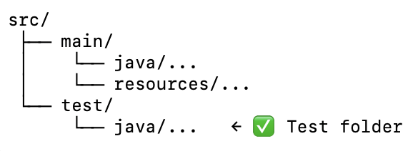
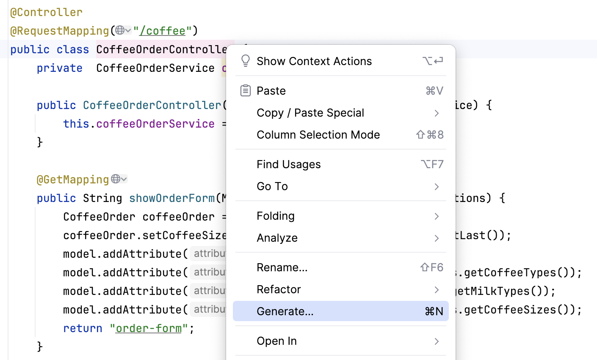
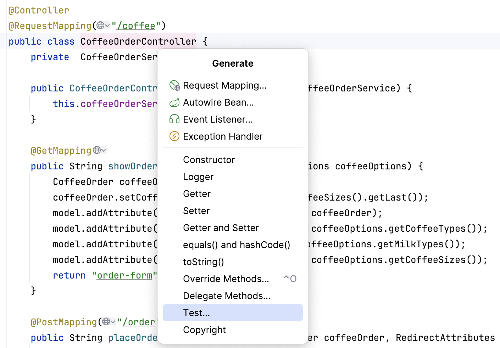
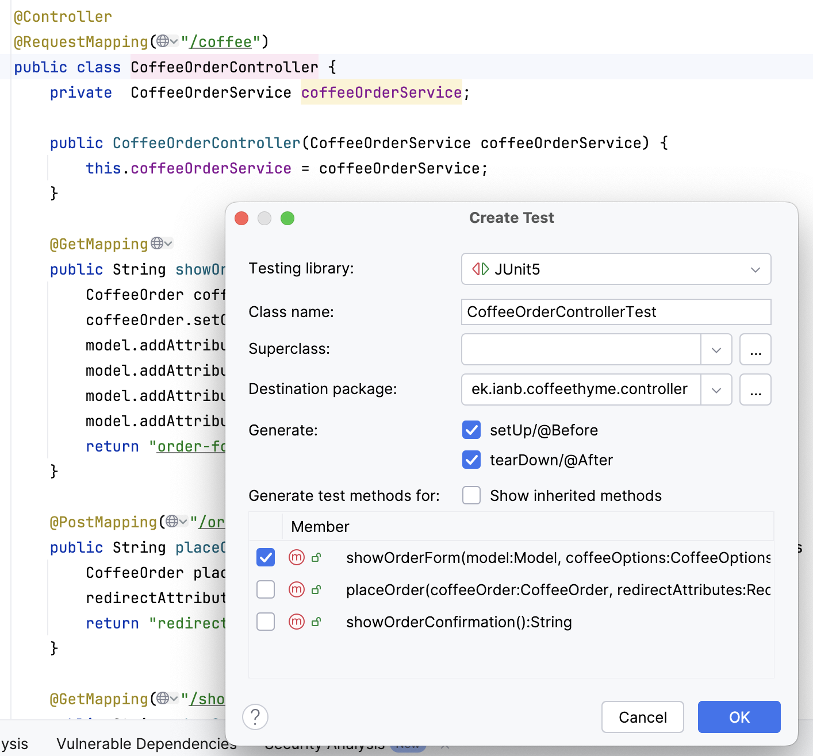
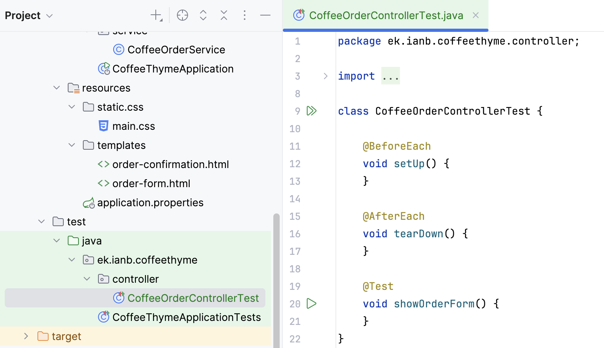
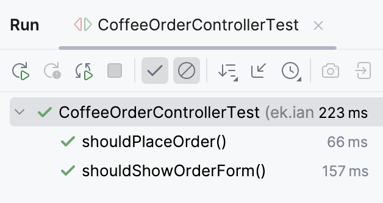

# Opgave: Weblayer Slice Test

Formålet med weblayer slice test er at:
- Verificere at HTTP endpoints i controlleren fungerer som forventet:
   - Rigtige HTTP-statuskoder (200 OK, 404 Not Found osv.).
   - Rigtigt viewnavn returneres.
   - Request og response-strukturer (path variables, query params, body).
- Sikre at controlleren er korrekt koblet til web-laget, uafhængigt af resten af applikationen.

I weblayer slice testing, testes web-laget isoleret
dvs. controllere, request mapping osv. uden at starte hele Spring-konteksten
eller de underliggende lag (service, repository, database).
- @WebMvcTest opretter en minimal Spring-kontekst, der kun loader MVC-komponenter (controllers osv.).
- Andre lag (fx @Service eller @Repository) bliver ikke startet, men kan mockes med @MockitoBean.
- MockMvc bruges til at simulere rigtige HTTP-requests og -responses mod controlleren, men uden at starte en (Tomcat) servlet container
## Test Dependencies

Når et Spring Boot-projekt oprettes i IntelliJ (via Spring Initializr), 
sker følgende:
- En testmappe (src/test/java) bliver oprettet automatisk.
- IntelliJ markerer den som test sources root.



- pom.xml får tilføjet spring-boot-starter-test, som samler de vigtigste testafhængigheder.


```xml
 <dependency>
    <groupId>org.springframework.boot</groupId>
    <artifactId>spring-boot-starter-test</artifactId>
    <scope>test</scope>
 </dependency>
 ```
---
## Fork starter projekt

Fork starter projektet til jeres egne GitHub repo fra:
[Link to coffee-thyme-starter projekt](https://github.com/EK-DATA-2SEM-PROGSYSTEK/coffee-thyme-starter.git)

Læs projekt koden og forklar til hinanden hvordan applikation fungerer.

Kør applikationen lokalt.

---
## Opret en test klasse
Højre klik på CoffeeOrderController, vælg Generate og dernæst vælg Test:






Vælg setUp og tearDown metoder samt metode(r) der skal testes:




En testklasse bliver oprettet i src/test/java med en metode, 
der tester den valgte metode i controlleren.



---
## Setup testklassen

I `CoffeeOrderControllerTest` klassen tilføj:
- `@WebMvcTest` annotationen til testklassen for at oprette en minimal Spring-kontekst, 
der kun indeholder web-laget.

- en `MockMvc` attribut (Spring håndterer injection af `MockMvc` objektet)

- en `@MockitoBean` attribut for at mocke `CoffeeOrderService` (service-laget).

```java
@WebMvcTest(CoffeeOrderController.class)
class CoffeeOrderControllerTest {
    @Autowired
    private MockMvc mockMvc;

    @MockitoBean
    private CoffeeOrderService coffeeOrderService;
```
---
## Teste form display endpoint
Her skal der testes at en GET request til `/order` endpointet 
returnerer en 200 OK status og view navnet `order-form`.

Omdøb den genererede testmetode `showOrderForm()` til `shouldShowOrderForm()` 
og implementer følgende:

```java
@Test
void shouldShowOrderForm() throws Exception {
    mockMvc.perform(get("/coffee"))
            .andExpect(status().isOk())
            .andExpect(view().name("order-form"));
    }
```

Tilføj import statements som IntelliJ foreslår:

```java
import static org.springframework.test.web.servlet.request.MockMvcRequestBuilders.get;
import static org.springframework.test.web.servlet.result.MockMvcResultMatchers.status;
import static org.springframework.test.web.servlet.result.MockMvcResultMatchers.view;
```
---
## Kør testen

Kør testmetoden:

 

Sikr at testen kører uden fejl:


---
## Teste form submission endpoint (POST request)

Her skal der testes en form submission via en POST request med parametere til `/order` endpointet.

Opret en ny test metode `shouldPlaceOrder()`:

```java
@Test
void shouldPlaceOrder() throws Exception {
}
```
Konfigurer den mockede `CoffeeOrderService` til at returnere et `CoffeeOrder` objekt, 
når metoden `placeOrder()` kaldes med et vilkårligt CoffeeOrder-objekt som argument (any(CoffeeOrder.class))

```java
@Test 
void shouldPlaceOrder() throws Exception {
    CoffeeOrder coffeeOrder = new CoffeeOrder("Flat White", "Medium", "Skim");
    when(coffeeOrderService.placeOrder(any(CoffeeOrder.class))).thenReturn(coffeeOrder);
}
```

Simuler en POST request til `/order` endpointet med de nødvendige parametre:

```java
@Test
    void shouldPlaceOrder() throws Exception {
        CoffeeOrder coffeeOrder = new CoffeeOrder("Flat White", "Medium", "Skim");
        when(coffeeOrderService.placeOrder(any(CoffeeOrder.class))).thenReturn(coffeeOrder);

        mockMvc.perform(post("/coffee/order")
                        .param("coffeeType", "Flat White")
                        .param("coffeeSize", "Medium")
                        .param("milkType", "Skim"))
                .andExpect(status().is3xxRedirection())
                .andExpect(view().name("redirect:/coffee/show-order"));

    }
```

Kør alle testene og verificer at de kører uden fejl.



Dernæste vil man gerne verificere at servicemetoden bliver kaldt med de forventede argumenter.
Service objeketet er mocket med @MockitoBean og derfor den "rigtige" service metode bliver ikke udført
men returneres værdien angivet i `when(...).thenReturn(...)` konfigurationen.

Mockitos `verify()` funktion bruges til at verificere at service metoden `placeOrder()` bliver kaldt og
med det forventede `coffeeOrder` argument.

```java
verify(coffeeOrderService).placeOrder(coffeeOrder);
```

Testmetoden vil dog fejle her fordi `coffeeOrder` objektet i `when(...).thenReturn(...)` og i `verify(...)` 
er to forskellige objekter og selvom `equals()` og `hashCode()` i `CoffeeOrder` er overskrevet (overridden) 
til at sammenligne objekternes indhold dvs. attributterne, så vil Mockito ikke kunne matche dem i dette tilfælde
fordi `coffeeOrder` attributten `orderId` er et random genereret UUID allokeret ved objektets oprettelse.


For at løse dette, kan `ArgumentCaptor` bruges til at fange det faktiske `CoffeeOrder` objekt,
der bliver sendt til `placeOrder()` metoden, og derefter verificere dets attributter.

Rediger testmetoden `shouldPlaceOrder()` til at bruge `ArgumentCaptor`:

```java
@Test
void shouldPlaceOrder() throws Exception {
  mockMvc.perform(post("/coffee/order")
                  .param("coffeeType", "Flat White")
                  .param("coffeeSize", "Medium")
                  .param("milkType", "Skim"))
          .andExpect(status().is3xxRedirection())
          .andExpect(view().name("redirect:/coffee/show-order"));

  ArgumentCaptor<CoffeeOrder> captor = ArgumentCaptor.forClass(CoffeeOrder.class);
  verify(coffeeOrderService).placeOrder(captor.capture());

  CoffeeOrder captured = captor.getValue();
  assertEquals("Flat White", captured.getCoffeeType());
  assertEquals("Medium", captured.getCoffeeSize());
  assertEquals("Skim", captured.getMilkType());
  assertNotNull(captured.getOrderId()); // UUID generated as expected
}
```

(NB. Ofte er det tilstrækkeligt at verificere at metoden er kaldt med de rigtige argumenter uden at bruge ArgumentCaptor)

Kør alle testene og verificer at de kører uden fejl.
