## Exercise: Merge conflict

The purpose of this exercise is to understand how merge conflicts can occur and how to resolve them.

The exercise should be done in pairs.
Before each step, discuss what the step does and the expected result.


### Instructions:
#### Setup
1. In IntelliJ, create a new Spring Boot project named `merge-conflict-exercise`.
2. Add a new file `profile.html` in the static resources folder of the project.
3. Add the following text to the `<body>` of the `profile.html` file:
   ```html 
   <h1>Exercise illustrating merge conflicts</h1>
   ```
4. Make an initial commit locally:

   In the terminal window in IntelliJ, run the command:

   ```bash 
   git commit -am "Initial commit"
   ```
   
5. Edit the text of the `<body>` of the `profile.html` file:
   ```html 
   <h1>Exercise illustrating merge conflicts</h1>
   <h2>Profile page</h2>
   ```
   Commit the change locally.

   In the terminal window in IntelliJ, run the command:

   ```bash 
   git commit -am "Added profile page heading"
   ```
   
6. In IntelliJ, share the project on GitHub
   (see [share on GitHub](https://www.jetbrains.com/help/idea/manage-projects-hosted-on-github.html#share-on-GitHub)
   if you are unsure on how to do this).

7. On GitHub, add a collaborator (your fellow student) to the repository
   (see [invite collaborators](https://docs.github.com/en/account-and-profile/how-tos/setting-up-and-managing-your-personal-account-on-github/managing-access-to-your-personal-repositories/inviting-collaborators-to-a-personal-repository)
   if you are unsure how to do this.
   (The collaborator should accept the invitation).

#### Adding a new feature

8. Before creating a new feature branch locally, the current local main branch should be updated to be in sync 
   with the remote main branch.

   In the terminal window in IntelliJ, run the command:

   ```bash
     git pull origin main
    ```

If you see an error message in the terminal window like:

```bash
remote: Invalid username or token. Password authentication is not supported for Git operations.
```

follow the instructions here
[GitHub CLI - Authentication](https://docs.github.com/en/get-started/git-basics/caching-your-github-credentials-in-git)
to enable GitHub CLI to automatically store your Git credentials.

10. Create a new local feature branch `feature/edit-profile` from main and switch to the new branch.

   In the terminal window in IntelliJ, run the command:

   ```bash
   git switch -c feature/edit-profile
   ```

11. In the editor in IntelliJ, edit the `profile.html` file:
   ```html 
      <h1>Exercise illustrating merge conflicts</h1>
      <h2>Profile page</h2>
      <p>Username</p>
   ```

12. Commit the changes to the local feature branch.

    In the terminal window in IntelliJ, run the command:

    ```bash
    git commit -am "Added username"
    ```
13. Make some more changes to the `profile.html` file in the local feature branch.
    In the editor in IntelliJ, edit the `profile.html` file:
   ```html 
      <h1>Exercise illustrating merge conflicts</h1>
      <h2>Profile page</h2>
      <p>Username</p>
      <p>Profile image</p>
   ```
   Commit the changes to the local feature branch.
   
   In the terminal window in IntelliJ, run the command:

   ```bash
     git commit -am "Added profile image"
   ```

14. While we have been working on the local feature branch, 
    our collaborators have been busy creating pull requests and merging them into main (remote).
    For simplicity here, we will quickly make these changes directly to the `profile.html` file on GitHub (remote).
    This should, of course, normally be done using GitHub flow workflow with pull requests.
    - On GitHub, navigate to the `profile.html` file in the repository.
    - Click on the pencil icon to edit the file.
    - Edit the text of the `<body>` of the `profile.html` file:
      ```html 
      <h1>Exercise illustrating merge conflicts</h1>
      <h2>Profile page</h2>
      <p>Profile details</p>
      ```
    - Click "Commit changes" and commit directly to main. 
      (This should not be done in a real project but is done here for simplicity).

      
15. Update the local main branch to be in sync with the remote main branch. First, switch to the local main branch.

    In the terminal window in IntelliJ, run the command:

    ```bash
    git switch main
    ```
    Merge the changes from the remote main branch into the local main branch:
    In the terminal window in IntelliJ, run the command:

    ```bash
    git pull origin main
    ```

    In this example, there will be no merge conflicts but merge conflicts may occur in general.
    They should be resolved if they do.

16. The branch diagram in IntelliJ should now look like this:

    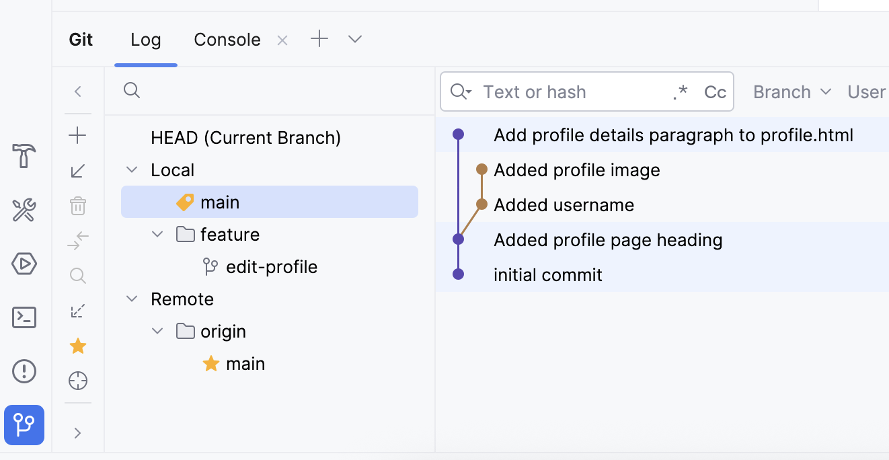

    Explain the branch diagram to your colleague.

17. Switch back to the local feature branch.

    In the terminal window in IntelliJ, run the command:

    ```bash
    git switch feature/edit-profile
    ```
    
18. Merge the local main branch into the local feature branch.
    In the terminal window in IntelliJ, run the command:

    ```bash
    git merge main
    ```

    Now, there will be a merge conflict.

     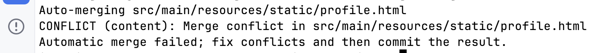
    
     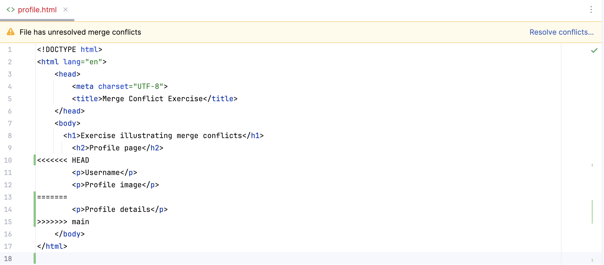


   The lines between `<<<<<<< HEAD` and `=======` are the changes from the local feature branch.

   The lines between `=======` and `>>>>>>> main` are the changes from the local main

   The merge conflict must be resolved manually by editing the `profile.html` file. This is described below.

#### Resolving the merge conflict

19. In the editor in IntelliJ, select *Resolve conflicts...*. The merge conflict editor will open.

    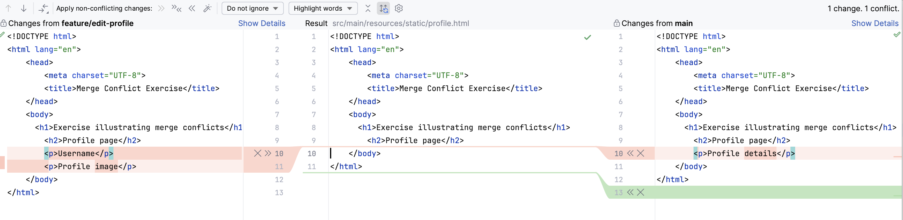

    Choose the changes to keep.

    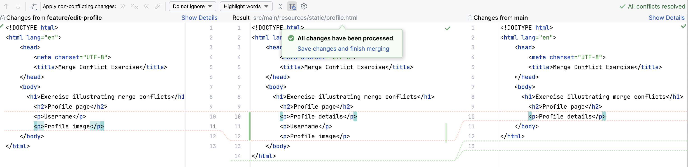

    Commit the resolved merge conflict on the local feature branch.

      ```bash
     git commit -am "Resolved profile merge conflict"
      ```

    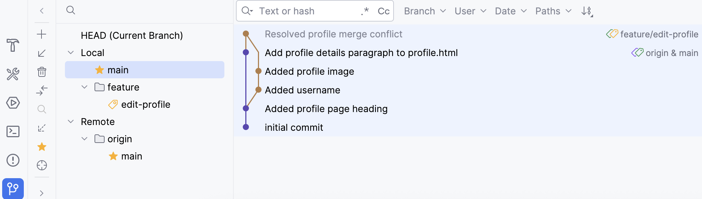


20. Push the local feature branch to the remote.

    In the terminal window in IntelliJ, run the command:

    ```bash
    git push origin feature/edit-profile
    ```


21. On GitHub, open a pull request to merge the feature branch into main:

    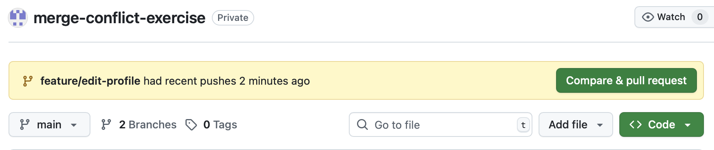

    - Make sure the feature branch is set as the source branch and main as the target branch.
    - Click on "Create pull request".
    - Add a title and description to the pull request.
    - Assign your fellow student as a reviewer.

    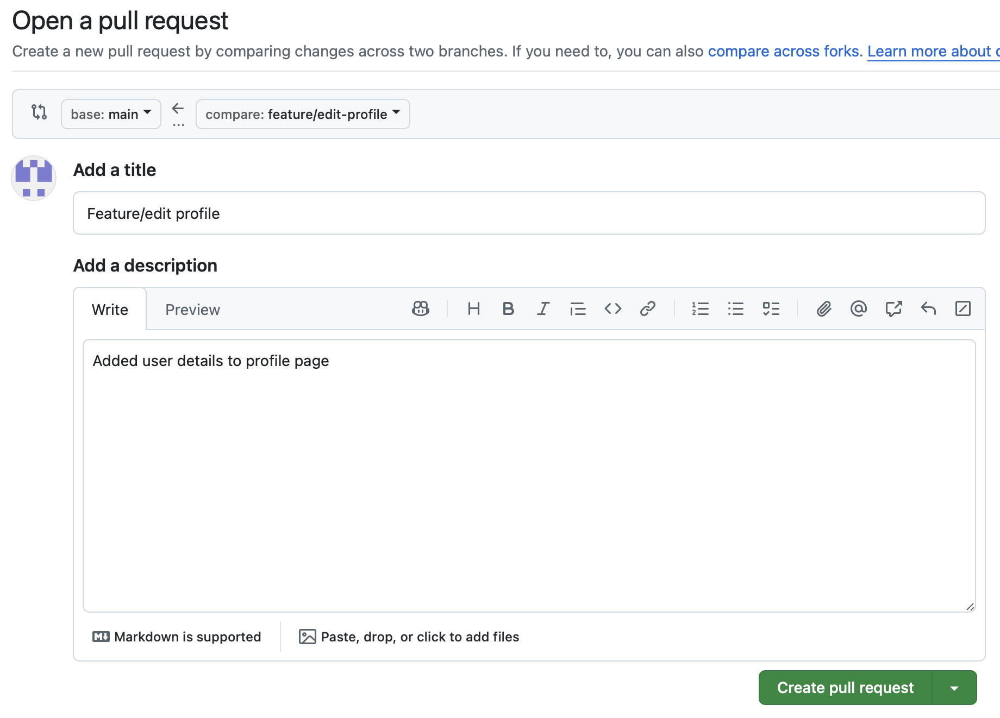 

    - Click on "Create pull request".
    - You should now see the pull request:

    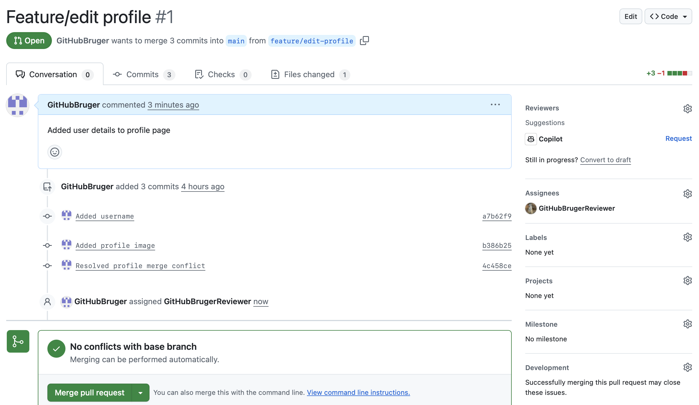

22. The reviewer (your fellow student) should now review the changes in the pull request.

    This is described in [Reviewing proposed changes in a pull request.](https://docs.github.com/en/pull-requests/collaborating-with-pull-requests/reviewing-changes-in-pull-requests/reviewing-proposed-changes-in-a-pull-request)

    The reviewer should:
    - Click on "Files changed" to see the changes.
    - Add comments if necessary.
    - Approve the changes if everything is fine.
    - Click on "Submit review".

    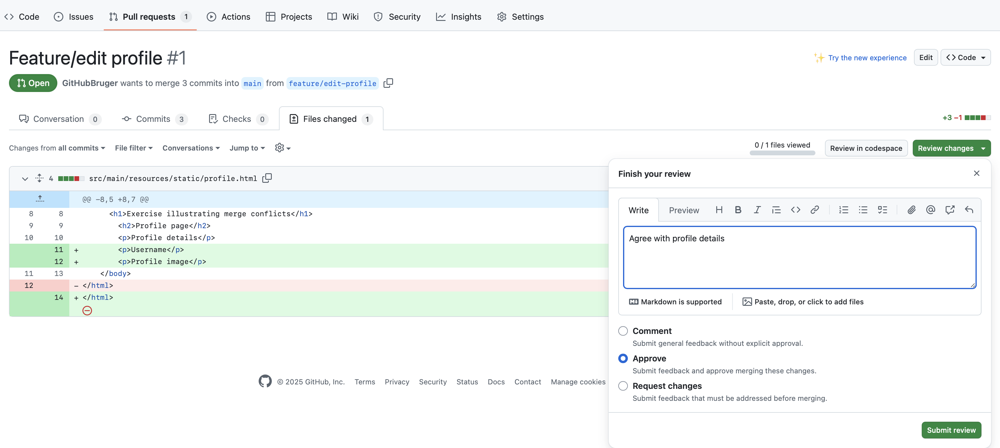    

23. The author of the pull request can now see the pull request has been approved
    and should now merge the changes into main.

    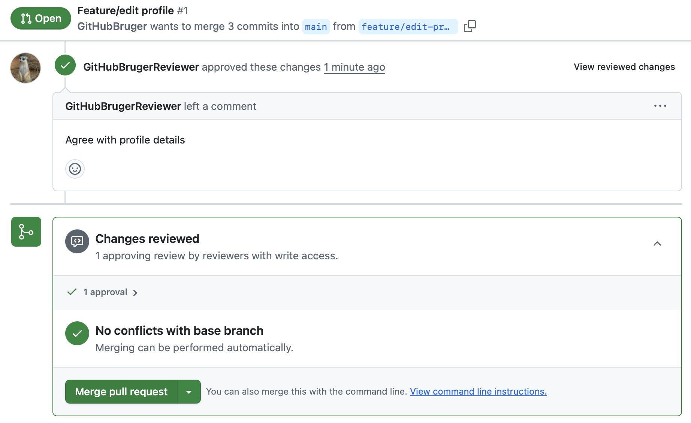 

    - Click on "Merge pull request" and then "Confirm merge".
    - The feature branch can now be deleted by clicking on "Delete branch".


24. The local feature branch can now be deleted.
    - First switch to the local main branch and update the local to be in sync with the remote main branch.
      In the terminal window in IntelliJ, run the command:

        ```bash
        git switch main
        git pull origin main
        ```

    - Then delete the local feature branch by running the command:
        ```bash
         git branch -d feature/edit-profile
      ```
      
    - Delete the remote tracking branch by running the command:
        ```bash
         git fetch origin --prune
      ```


 


 


