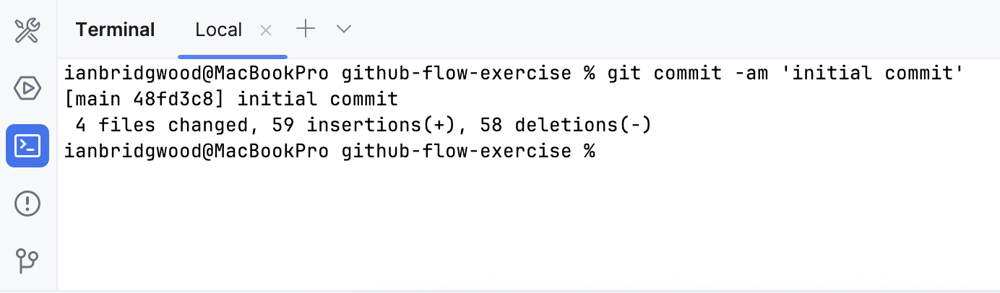
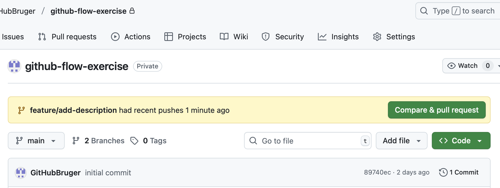
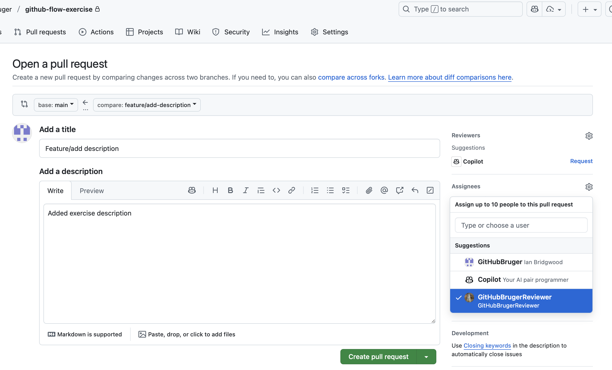
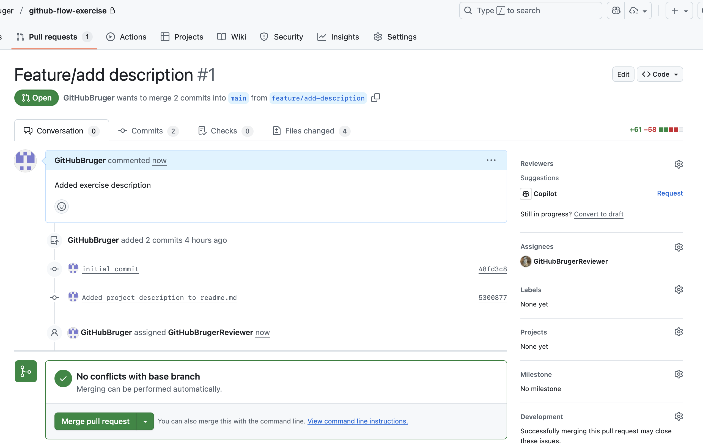
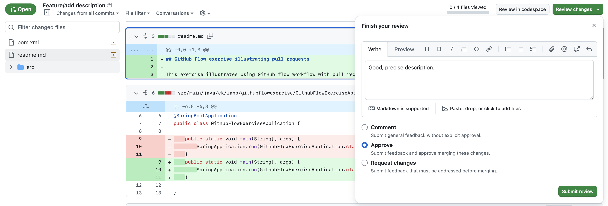
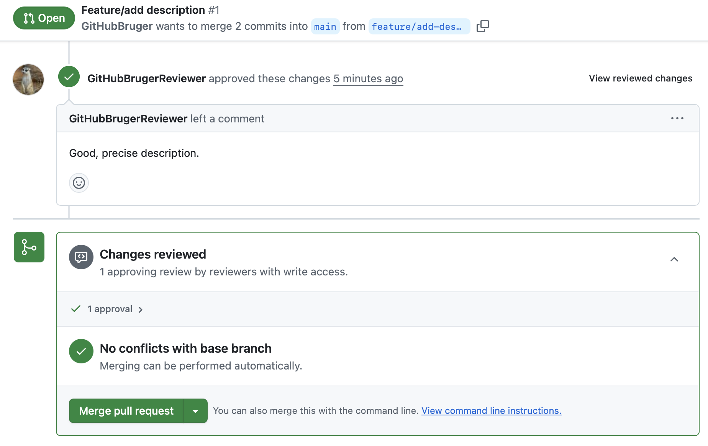
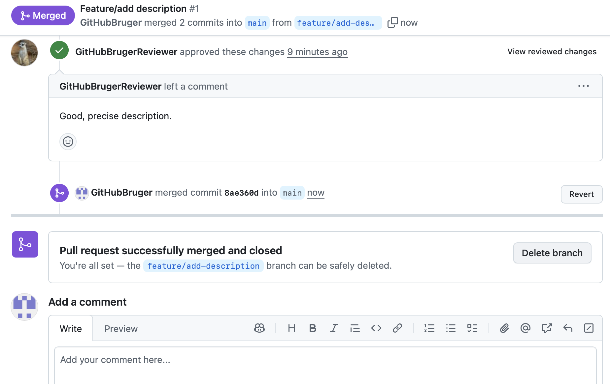

## Exercise: GitHub Flow and Pull Requests

The purpose of this exercise is to be able to use GitHub Flow to collaborate on a project.
The exercise illustrates creating a feature branch, making changes, 
opening a pull request and merging the approved changes.

The exercise should be done in pairs.
Before each step, discuss what the step does and the expected result.


### Instructions:
### Setup
1. In IntelliJ, create a new Spring Boot project named `github-flow-exercise`.
2. Add a new file `readme.md` to the root of the project.
3. Add the following text to the readme.md file:
   ```text 
   ## GitHub flow exercise illustrating pull requests
   ```
4. Make an initial commit locally:

   In the terminal window in IntelliJ, run the command:

   ```bash 
   git commit -m "Initial commit"
   ```
   
   You should see that a new commit has been created in the local repository:
     

5. In IntelliJ, share the project on GitHub 
 (see [share on GitHub](https://www.jetbrains.com/help/idea/manage-projects-hosted-on-github.html#share-on-GitHub) 
 if you are unsure on how to do this).

   
6. On GitHub, add a collaborator (your fellow student) to the repository
   (see [invite collaborators](https://docs.github.com/en/account-and-profile/how-tos/setting-up-and-managing-your-personal-account-on-github/managing-access-to-your-personal-repositories/inviting-collaborators-to-a-personal-repository) 
   if you are unsure how to do this.
   (The collaborator should accept the invitation).

### Adding new features, bug fixes, etc.

7. Update the current local main branch to be in sync with the remote main branch.

   In the terminal window in IntelliJ, run the command:

   ```bash
     git pull origin main
    ```

If you see an error message in the terminal window like:

```bash
remote: Invalid username or token. Password authentication is not supported for Git operations.
```

follow the instructions here 
[GitHub CLI - Authentication](https://docs.github.com/en/get-started/git-basics/caching-your-github-credentials-in-git)
to enable GitHub CLI to automatically store your Git credentials.

8. Create a new local feature branch from main.

   In the terminal window in IntelliJ, run the command:

   ```bash
   git checkout -b feature/add-description
   ```

9. In the editor in IntelliJ, add the following text to the readme.md file:
   ```text 
   ## GitHub flow exercise illustrating pull requests

   This exercise illustrates using GitHub flow workflow with pull requests.
   ```
   
10. Commit the changes to the local feature branch.

    In the terminal window in IntelliJ, run the command:

    ```bash
    git commit -am "Added project description to readme.md"
    ```
    
11. Update the local main branch to be in sync with the remote main branch.

    In the terminal window in IntelliJ, run the command:

    ```bash
    git pull origin main
    ```
    
12. Merge the local main branch into the local feature branch.

    In the terminal window in IntelliJ, run the command:

    ```bash
    git merge main
    ```
    In this example, there will be no merge conflicts but merge conflicts may occur in general. 
    They should be resolved if they do (this addressed in another exercise).

13. Push the local feature branch to the remote.

    In the terminal window in IntelliJ, run the command:

    ```bash
    git push origin feature/add-description
    ```

14. On GitHub, open a pull request to merge the feature branch into main:

    
    
    - Make sure the feature branch is set as the source branch and main as the target branch.
    - Click on "Create pull request".
    - Add a title and description to the pull request.
    - Assign your fellow student as a reviewer.
    
     
    
    - Click on "Create pull request".
    - You should now see the pull request:
    
    

15. The reviewer (your fellow student) should now review the changes in the pull request.

    This is described in [Reviewing proposed changes in a pull request.](https://docs.github.com/en/pull-requests/collaborating-with-pull-requests/reviewing-changes-in-pull-requests/reviewing-proposed-changes-in-a-pull-request)

    The reviewer should:
    - Click on "Files changed" to see the changes.
    - Add comments if necessary.
    - Approve the changes if everything is fine.
    - Click on "Submit review".

        

16. The author of the pull request can now see the pull request has been approved 
    and should now merge the changes into main.

     

    - Click on "Merge pull request" and then "Confirm merge".
    - The feature branch can now be deleted by clicking on "Delete branch".

    

17. The local feature branch can now be deleted.
    - First switch to the local main branch and update the local to be in sync with the remote main branch.
      In the terminal window in IntelliJ, run the command:

        ```bash
        git checkout main
        git pull origin main
        ```
          
    - Then delete the local feature branch by running the command:
        ```bash
         git branch -d feature/add-description
      ```
    - Delete the remote tracking branch by running the command:
      ```bash
       git fetch origin --prune
      ```


 


 


