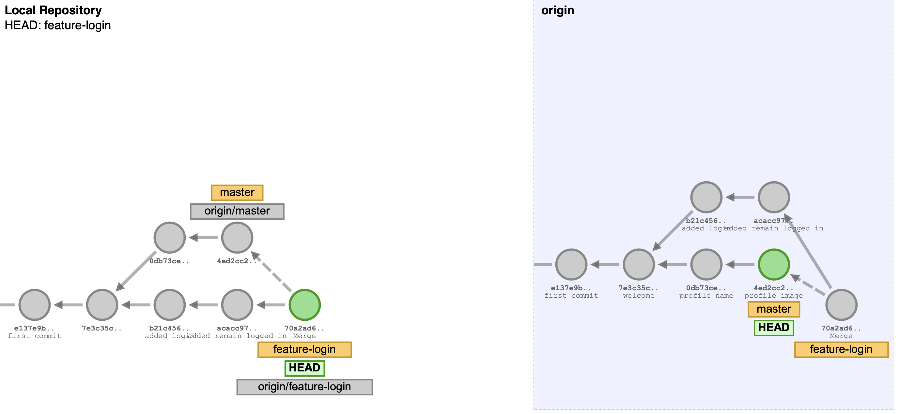
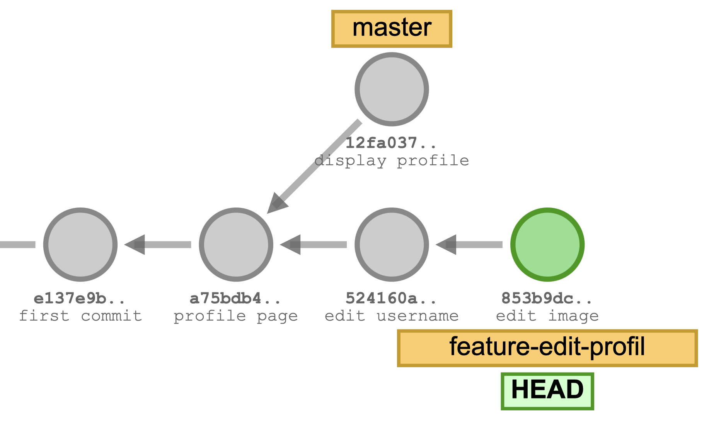

# Kode review med pull requests

---

## Beskrivelse

Vi skal arbejde med at kvalitetssikre koden vha. Pull Requests. 
Når en udvikler pusher sin kode til Github, skal resten af teamet (eller udvalgte teammedlemmer) i en pull request 
kunne reviewe og diskutere de nye ændringer, før de integreres ind i main branch.

---
## Forberedelse

GitHub har en række interaktive kurser med forskelligt tema.
Du skal inden undervisning i dag have været igennem intro-kurset
[Introduction to GitHub](https://github.com/skills/introduction-to-github) for at få opfrisket brugen af branches 
og for at få en introduktion til at åbne en pull request og merge en pull request.

Se videoer:

[Beginner Git commands you need to know (WITH EXAMPLES)](https://youtu.be/rE2zRhZdjFU?feature=shared)

[How to create a pull request in 4 min | GitHub for Beginners](https://youtu.be/nCKdihvneS0)

[How to merge a pull request | Introduction to GitHub](https://youtu.be/FDXSgyDGmho?feature=shared)

[IntelliJ IDEA: Resolving Merge Conflicts in Git](https://youtu.be/WgipWkaU2MM?feature=shared)

---
## Læringsmål
- At kunne anvende GitHub flow workflow.
- At kunne anvende pull requests i Github til kodereviews.

---
## Indhold
- Forberedelsen (Parvis: kommentarer og spørgsmål)
- GitHub flow workflow
- Opgave: Pull request
- Opsummering af opgaven
- Merge conflicts
- Opgave: Merge conflict
- Opsummering af opgaven

---
### GitHub flow workflow
[GitHub Flow](https://docs.github.com/en/get-started/using-github/github-flow) "is a lightweight, branch-based workflow"
to collaborate on projects.

[GitHub flow video](https://youtu.be/rE2zRhZdjFU?feature=shared&t=780)

---
### GitHub flow (i detalje)

1.	Clone GitHub-repository (gøres én gang)
2.	Opdater den lokale main-branch
3.	Opret en lokal feature-branch
4.	Lav commits til feature-branchen
5.	Opdater den lokale main-branch
6.	Merge main-branchen ind i feature-branchen
7.	Push den lokale feature-branch til remote
8.	Opret en pull request på GitHub og tildel en reviewer
9.	Revieweren gennemgår ændringerne
10.	Merge feature-branchen ind i main-branchen (på remote)
11.	Slet feature-branchen (på remote og lokalt)
12. Repeat from step 2 for the next feature or bugfix

---
### GitHub flow illustreret

[Visualising GitHub flow](visualising-github-flow.md)

---

### Opgave: Pull request

Lav opgaven [Pull request](opgave-pull-request.md).

---

### Opsummering af opgaven

---

### Merge conflicts

En merge-konflikt opstår, når der laves ændringer i den samme del af en fil på to forskellige grene (branches).

Git ved ikke, hvilke ændringer der skal anvendes, og konflikten skal løses af udvikleren, før der kan laves et commit, 
eller før en pull request kan merges.

---

### Merge conflicts

Hvad viser diagrammet?

Kan en merge konflikt opstå?

Merge-konflikter bør opdages og løses i den lokale repo – inden der forsøges at oprette en pull request.

---

### Merge conflicts

---
### Opgave: Merge conflict

Lav opgaven [Merge conflict](opgave-merge-conflict.md).

---

### Opsummering af opgaven

---

## Aktiviteter
