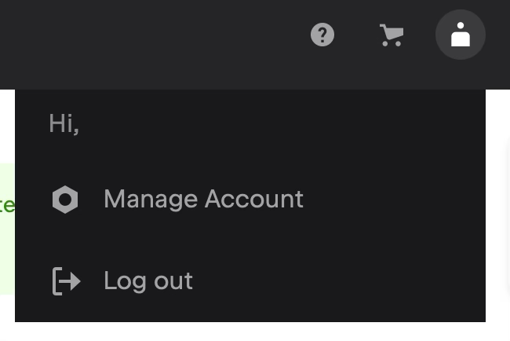

## Aktivering af Qodana licenser i IntelliJ

[Qodana](https://www.jetbrains.com/qodana/) er et statisk kode analyse værktøj fra JetBrains. 

EK er blev allokeret classroom licenser som kan bruges til at anvende Qodana 
(Qodana er ikke omfattet af de personlige “educational” licenser til f.eks IntelliJ Ultimate Edition). 

Licenserne er dynamiske og aktiveres i f.eks. IntelliJ IDE og frigives 
når IDE lukkes eller computeren går i dvale eller slukkes.

---

### Ændringen af JetBrains Konto email til `ditstudienummer@stud.ek.dk`

For at kunne anvende licenserne skal emailen på din JetBrains konto være din EK studie email 
dvs. `dinstudienummer@stud.ek.dk`

Emailen kan ændres på [JetBrains Account](https://account.jetbrains.com/).

Klik på profile ikonet øverst til højre og vælg `Manage Account`.

Ændr din email til `ditstudienummer@stud.ek.dk` og følg IntelliJ vejledningen for at bekræfte ændringen.

---

### Aktiveringen af IntelliJ License

For at aktivere licensen i IntelliJ vælg Help -> Manage Subscriptions

I license vinduet angiv serveradressen: `https://ek-digital.fls.jetbrains.com`
og vælg Activate:

---

### Qodana cloud

[Qodana cloud](https://qodana.cloud/) er en cloud baseret version af Qodana hvor der kan oprettes teams, inviterer medlemmer 
og tilknytte GitHub repoer samt konfigurere GitHub Actions CI workflows.

EK har en organisation på Qodana cloud som kan anvendes til undervisning og projekter.

For at blive medlem af EK organisationen på Qodana cloud skal der accepteres en invitation sendte til din EK studiemail.
