# Statisk kodeanalyse med tools

---
## Beskrivelse
Introduktion til statisk kodeanalyse undersøger kodekvalitet uden at køre et program. 
Et statisk kodeanalyseværktøj undersøger koden ud fra en række koderegler, 
som f.eks. at metoder ikke må være alt for lange eller indeholde for komplekse algoritmer. 

Vi skal arbejde med:
- IntelliJ’s Code Inspection
- Qodana

I skal arbejde med kodekvaliteten i Turistguide projektet vha. statisk kodeanalyse og pull request.

---
## Forberedelse

Læs:

[Code quality developer's guide](https://www.sonarsource.com/learn/code-quality/)

[Code review](https://www.sonarsource.com/learn/code-review/)

Se videoen:

[Qodana Code Quality Platform - Overview](https://youtu.be/WrhnUnzMUCg?feature=shared)

(Vær ikke bekymret over Docker, workflow og GitHub Actions – det vi har behov for kommer senere...)

---
## Læringsmål
- At kunne anvende statisk kodeanalyse til at forbedre kodekvaliteten i et projekt
- At kunne anvende et statisk kodeanalyseværktøj

---
## Indhold
- Kodekvalitet
- Statisk kodeanalyse
- Værktøj

---
### Kodekvalitet

Hvad forståes der ved kodekvalitet?

Hvordan opnåes kodekvalitet?

Diskuter med din sideperson

---
Software skal nemt at:

- forstå
- vedligeholde
- teste

---
### Kodekvalitet

[Opgave: Kvalitetskode?](opgave-kvalitetskode.md)

---
### Kodekvalitet

- kodestandarder og kodestyle
  - navngivning
  - formatering
  - strukturering
- arkitektur
- designprincipper
  - SOLID
  - High Cohesion, Low Coupling
  - SRP (Single Responsibility Principle)
  - DRY (Don't Repeat Yourself)
  - designmønstre 
- testbarhed
  - dependency injection
- robusthed
- performance
- sikkerhed
- pålidelighed
---

### Statisk kodeanalyse
Undersøge kodekvalitet uden at køre programmet.

Tidlig identifikation af potentielle problemer (inden pull request reviews).

Reducerer omkostninger i senere faser af softwareudviklingsprocessen.

---

### Kodekvalitet metrikker

[Code Quality Metrics](https://blog.jetbrains.com/qodana/2023/10/top-6-code-quality-metrics-to-empower-your-team/)

- cyclomatic complexity (CYC)
- code duplication percentage
- code coverage by tests
- number of potential bugs
- code smells
- number of security vulnerabilities

---
#### Lint (fnug) værktøj

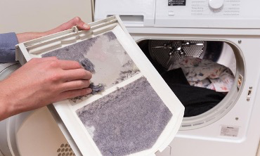

Et linter er et værktøj, der analyserer kildekode for at finde potentielle fejl,
kodestilproblemer og andre uoverensstemmelser med kodningsstandarder.

---
### Værktøj
#### IntelliJ’s Code Inspection

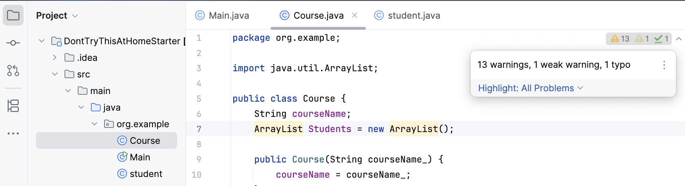

---

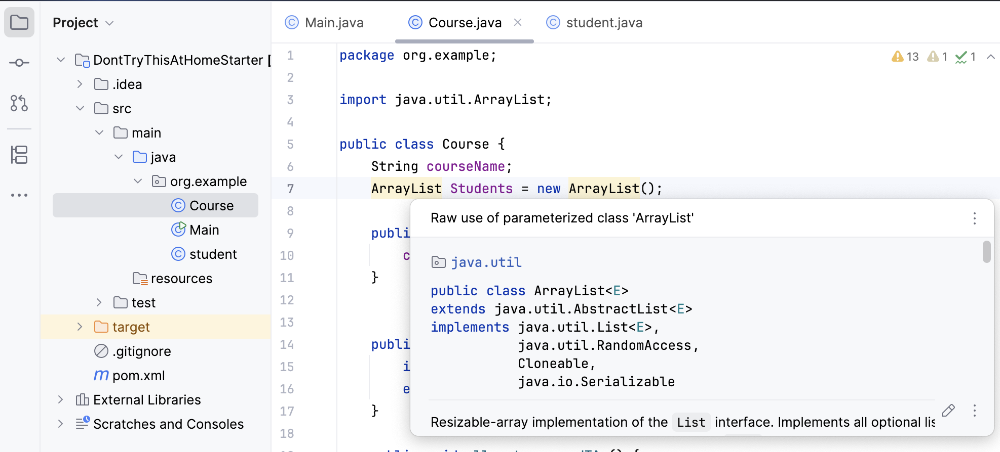

---

#### IntelliJ Code Inspection

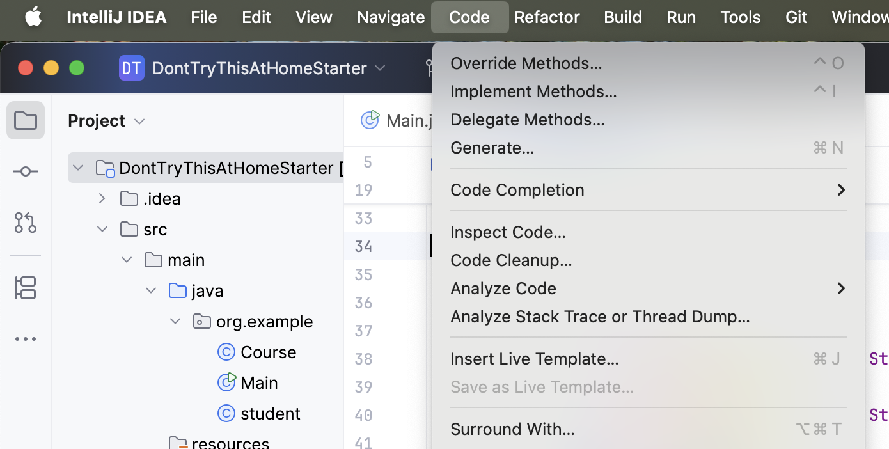

---

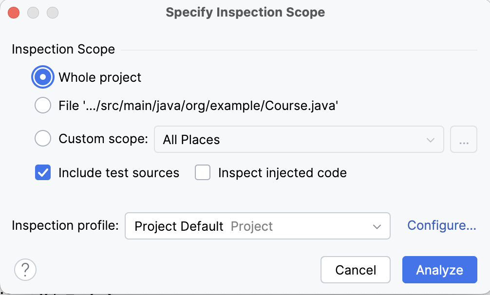

---

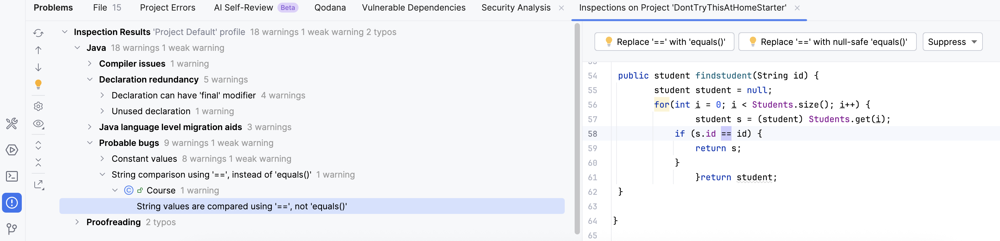

---

Opgave: [IntelliJ Code Inspection](opgave-intellij-code-inspection.md)

---

#### Qodana

Qodana er et statisk kodeanalyseværktøj (bundled gratis med IntelliJ IDEA Ultimate).

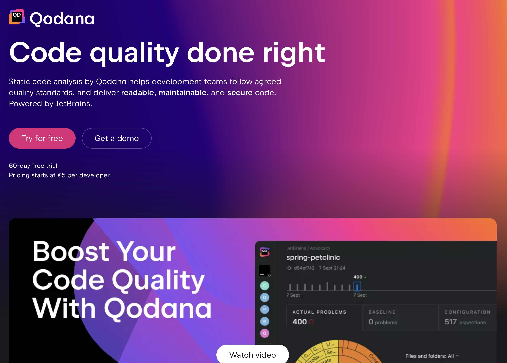

---

Vælg Tools > Qodana > Try Code Analysis with Qodana

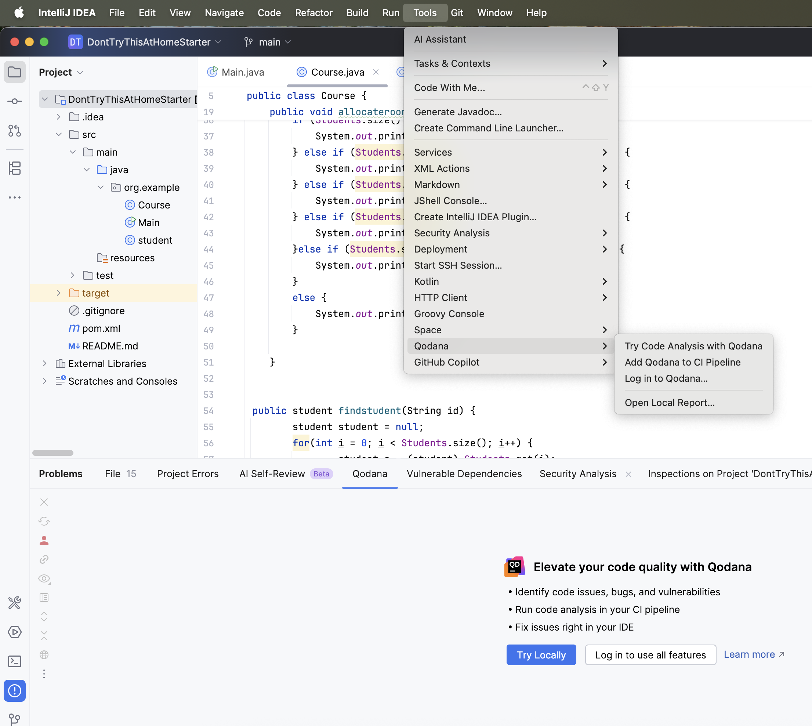

---

Ændre profile name i `qodana.yaml` filen til `qodana.recommended`

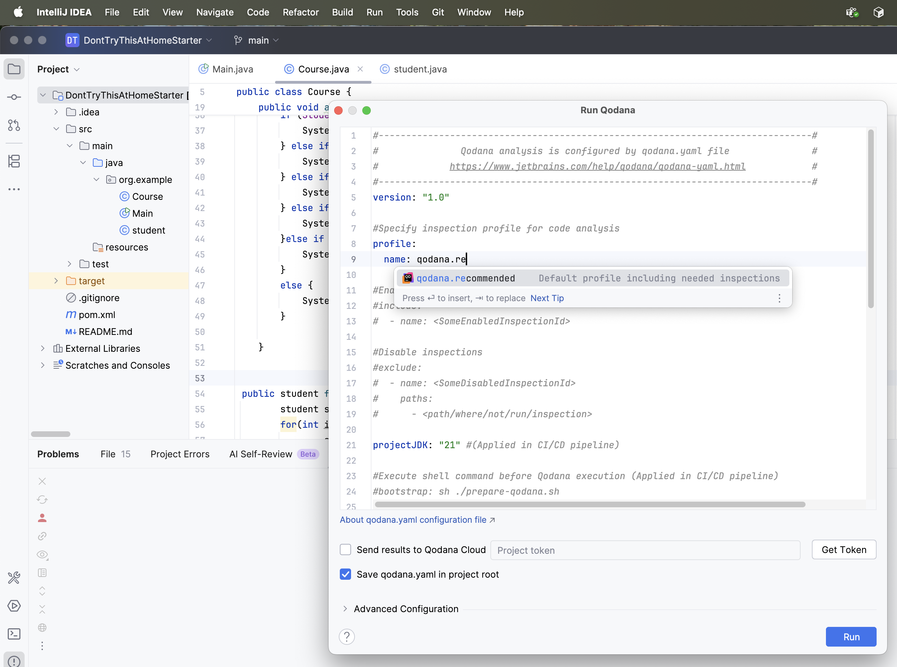

---

#### Qodana rapporter

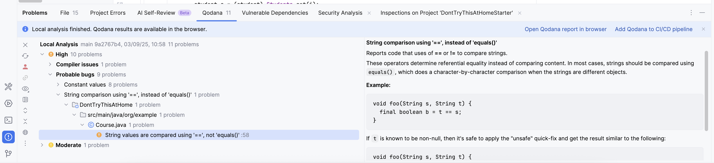

---

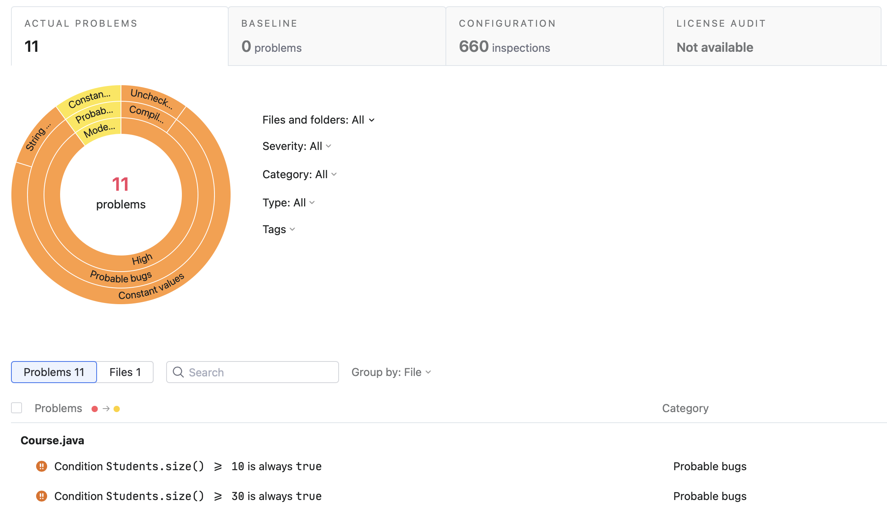

---

#### Opgave

[Qodana analyse af Turistguide](opgave-qodana.md)

---

## Aktiviteter

---
