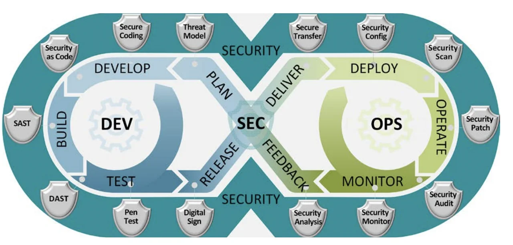

# GitHub Actions 2

## Beskrivelse
Vi fortsætter med GitHub Actions og ser på hvad DevSecOps dækker over. Vi bruger Qodana i livscyklusen som et eksempel på et Static Application Security Testing (SAST) tool. Vi arbejder med at oprette Continuous Integration (CI) work flow på Turistguide projektet.
Det betyder at der i workflowet skal:  
- udføres statisk kodeanalyse (Qodana)
- eksekveres unit tests
## Forberedelse
Se disse videoer:  
[Everything you NEED to know about DevSecOps in 5 Minutes](https://www.youtube.com/watch?v=DTEaw2-Sa7I)  
[Qodana Code Quality Platform – Overview](https://www.youtube.com/watch?v=WrhnUnzMUCg)  
[Configure Qodana with GitHub Actions](https://www.youtube.com/watch?v=JrWQkqaXZFQ)

## Læringsmål
- Anvende Qodana i en CI pipeline

## Indhold

### Hvad er DevSecOps?
  

DevSecOps er en videreudvikling af DevOps, hvor **sikkerhed** (SEC) bliver en integreret del af hele softwarelivscyklussen – fra udvikling (DEV) til drift (OPS).  
I stedet for at tilføje sikkerhed som en sidste kontrol, bygges sikkerhed ind i alle faser: **Plan → Build → Test → Release → Deploy → Operate → Monitor → Feedback**.

Formålet er at opdage fejl, sårbarheder og kvalitetsproblemer så tidligt som muligt, så de ikke først opdages, når applikationen er sat i produktion.

---

### Qodana i DevSecOps
Qodana er JetBrains’ **Static Application Security Testing (SAST)** værktøj.  
Det betyder, at Qodana analyserer kildekoden **uden at køre programmet**, og dermed kan finde fejl, kodebrud på regler og potentielle sikkerhedsproblemer allerede i udviklingsfasen.

I DevSecOps-cyklussen (se figur) hører Qodana især hjemme i disse faser:

- **Build & Test (DEV)**  
  - Qodana kører som en del af CI/CD-pipelinen og analyserer koden automatisk ved hvert commit eller pull request.  
  - Den kan fange **kode smells**, **sikkerhedsproblemer** og **licenskonflikter**, inden koden overhovedet merges.  
  - Dermed understøtter Qodana princippet om *"Shift Left Security"* – at finde fejl så tidligt som muligt.

- **Release**  
  - Ved at integrere Qodana-rapporter i build pipelines sikrer man, at kun kode, som lever op til organisationens kvalitets- og sikkerhedskrav, bliver frigivet.

- **Feedback**  
  - Udviklere får hurtig feedback direkte i IDE’en eller via pull request-kommentarer.  
  - Det betyder, at sikkerhed og kvalitet bliver en naturlig del af udviklernes daglige arbejde – ikke noget, der først opdages senere i processen.

---

### Hvordan bruges Qodana i praksis?
1. **Lokalt i IDE’en**  
   - Udvikleren kan køre Qodana-inspektioner direkte i JetBrains IDE’er og få feedback med det samme.

2. **I CI/CD pipeline (GitHub Actions, GitLab, Azure DevOps, Jenkins m.fl.)**  
   - Qodana integreres som et build-step, der automatisk stopper et build, hvis kritiske sikkerheds- eller kvalitetsfejl opdages.  
   - Rapporterne kan eksporteres i et standardformat (SARIF), så resultaterne kan vises i GitHub Security eller andre dashboards.

3. **Policy enforcement**  
   - Teams kan definere regler for, hvad der må passere (f.eks. *ingen kritiske sikkerhedsfejl*, *ingen nye licenskonflikter*).  
   - Dette understøtter governance og compliance i organisationen.

---

### Hvorfor er Qodana vigtig i DevSecOps?
- Den gør sikkerhed til en **integreret del af udviklingen**.  
- Den giver **hurtig feedback** til udviklere.  
- Den understøtter **compliance og governance**.  
- Den reducerer omkostninger ved at finde fejl tidligt.  

Kort sagt hjælper Qodana med at skabe en **kultur, hvor sikkerhed er alles ansvar** – præcis som DevSecOps-tilgangen foreskriver.

## Aktiviteter  
Arbejde med at oprette en CI pipeline i turistguide projektet med ingtegration af Qodana static analysis.  
Følg vejledning i [Oprettelse af projekt på Qodana Cloud](resources/Opret%20projekt%20på%20Qodana%20Cloud.md)
