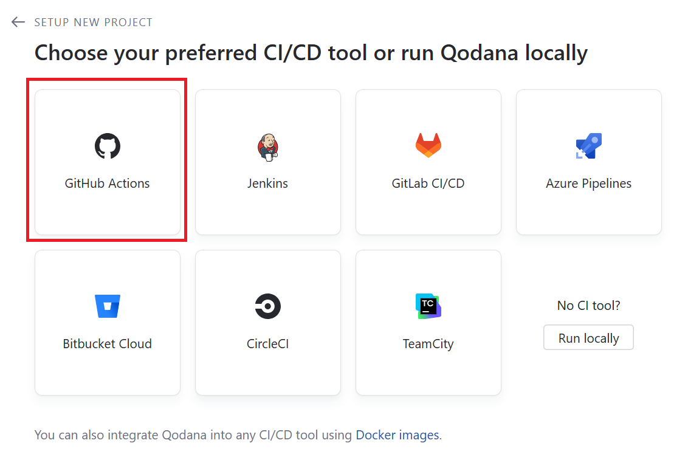
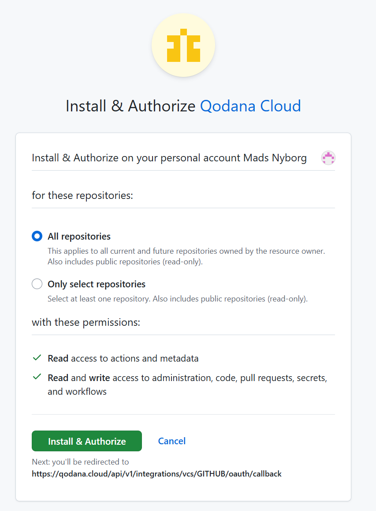
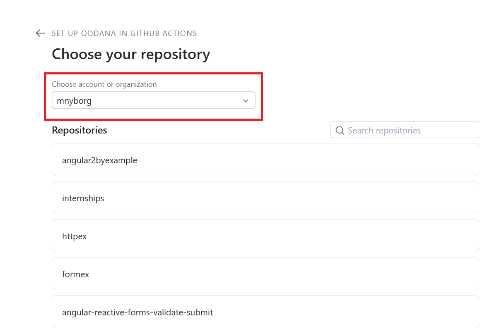
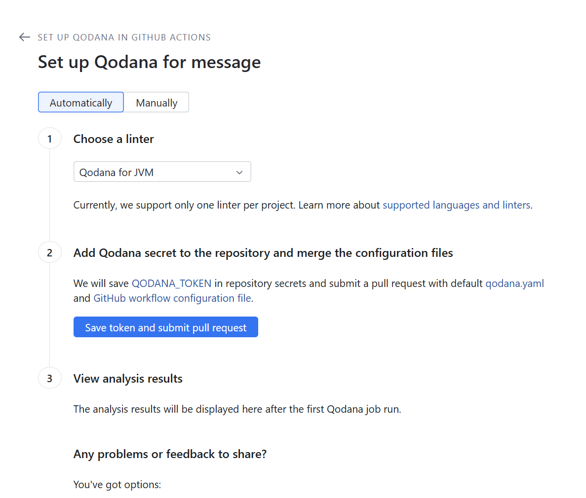
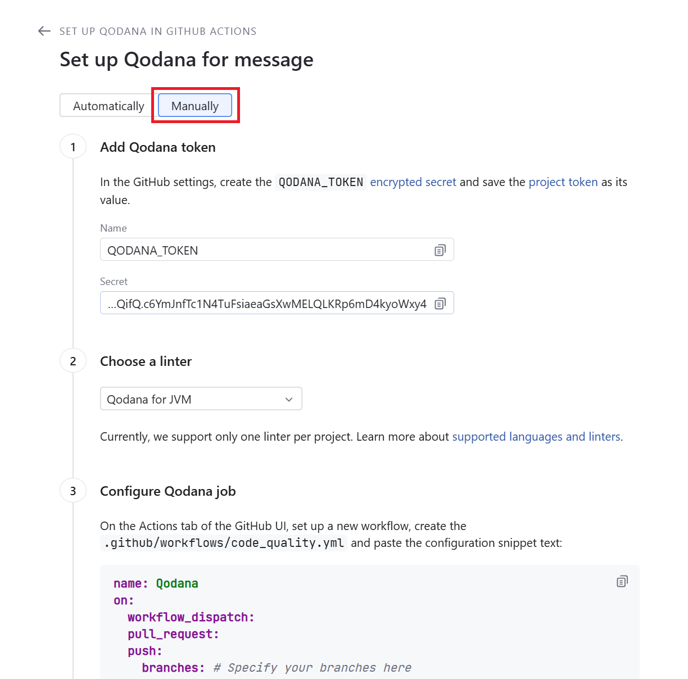
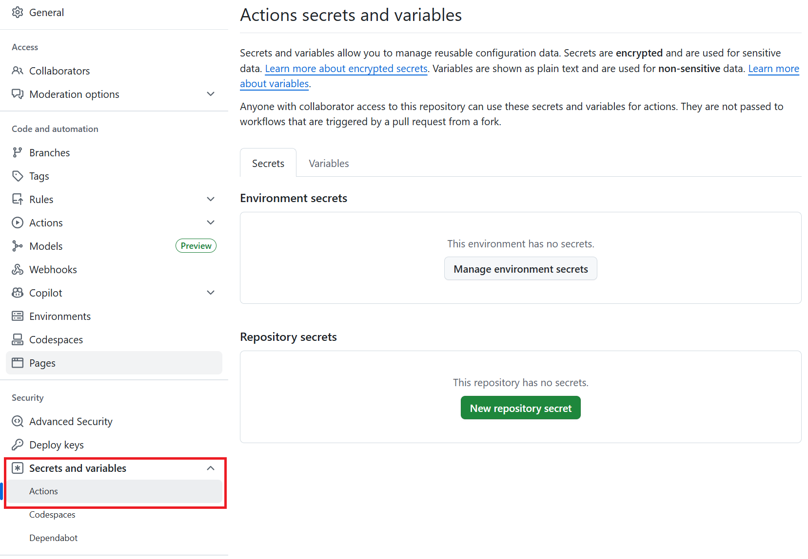
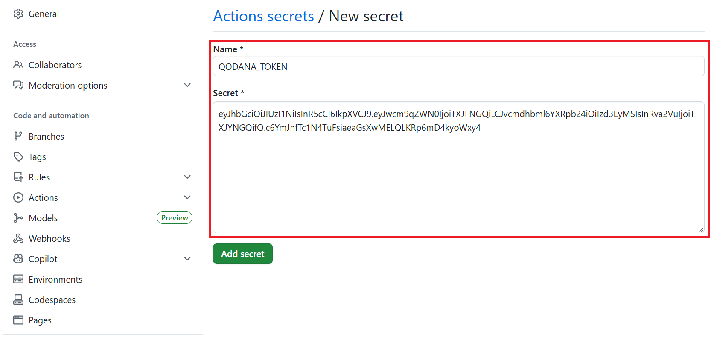

# Opret projekt på Qodana Cloud  
1. I Qodana Cloud vælgers 'Create project' og projektnavn indtastes.  
Herefter vælges GitHub Actions:  
  
2. Qodana skal nu autoriseres til GitHub: 

  
  

  
  
  

