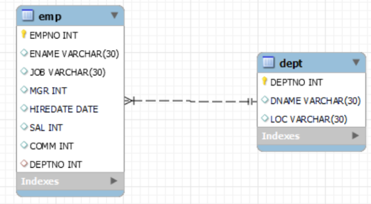

# SQL SELECT opgaver  

Følgende øvelser forudsætter, at SQL Scriptet `emp_dept_25.sql` er kørt (opretter databasen kaldet **EMP_DEPT_25**).  

---

## Figur 1 – ER model for databasen  

---

## 1. Forespørgsler på en enkelt tabel  

a) List all information about all departments  
b) Find the employee number (`empno`) for employees named **MARTIN**.  
c) Find the employee(s) with a salary greater than 1500.  
d) Find all job types – list each only once.  
e) List the names of salesmen that earn more than 1300.  
f) List the names of employees that are not salesmen.  
g) List the names of all clerks together with their salary with a deduction of 10%.  
h) Find the name of employees hired before May 2021.  
i) List name and job for employees whose name ends with `s`.  
j) List employees sorted by name.  
k) List employees sorted by salary in descending order (i.e. highest salary first).  
l) Find name of employee without a manager (i.e. the CEO).  
m) List departments sorted by location.  
n) Find name of department located in **New York**.  

---

## 2. Aggregatfunktioner  

a) List the number of employees.  
b) List the sum of all salaries (excluding commission).  
c) List the average salary for employees in department 20.  
d) List the unique job titles in the company.  
e) List the number of employees in each department.  
f) List in decreasing order the maximum salary in each department together with the department number.  
g) List total sum of salary and commission for all employees.  

