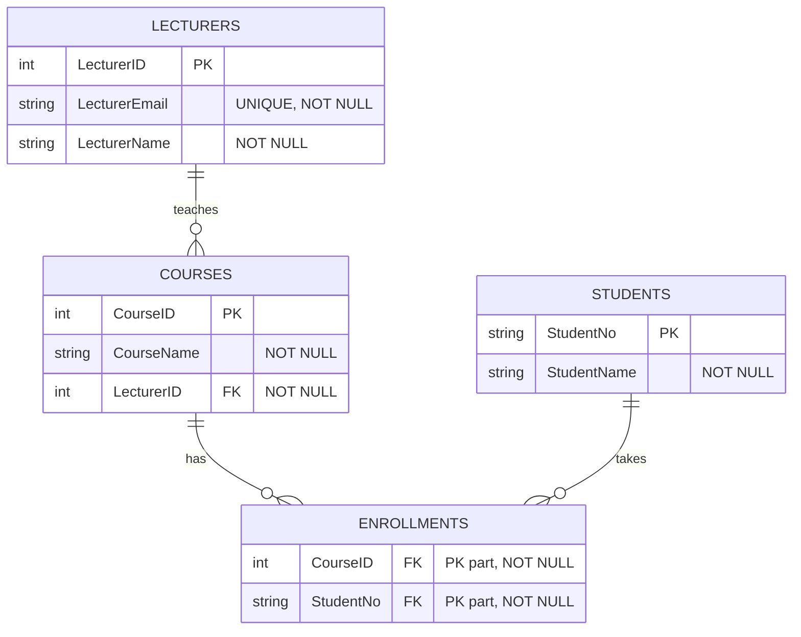

# Turistguide del 3, normalisering, SQL DDL

## Beskrivelse

Vi ser hvordan vi kan strukturere en database og organiserer data i tabeller på en måde, 
der reducerer redundans (gentagne data) og forbedrer dataintegritet. 
Det gør vi ved at kigge på 1., 2. og 3. normalform.

Vi ser også på hvordan vi kan anvende SQL DDL (Data Definition Language) til at oprette databaser og tabeller.

## Forberedelse

Se videoer:

[Normalization: first, second and third form](https://www.linkedin.com/learning-login/share?account=36836804&forceAccount=false&redirect=https%3A%2F%2Fwww.linkedin.com%2Flearning%2Fprogramming-foundations-databases-2%2Fnormalization-2%3Ftrk%3Dshare_video_url%26shareId%3DIsTl7CEuSX6lgNbtVl3%252Ftg%253D%253D)

[DDL](https://www.linkedin.com/learning-login/share?account=36836804&forceAccount=false&redirect=https%3A%2F%2Fwww.linkedin.com%2Flearning%2Fprogramming-foundations-databases-2%2Fcreating-a-database%3Ftrk%3Dshare_video_url%26shareId%3DUIS%252FcAcMQxmgB6iVaSU0bg%253D%253D)

## Læringsmål

- At kunne beskrive 1., 2. og 3. normalform.
- At kunne normalisere en database til 3. normalform.
- At kunne anvende SQL DDL til at oprette databaser og tabeller.

## Indhold

---

### Normalisering

#### Formålet

Det overordnede formål med normalisering er at organisere data i en database på en måde, 
der reducerer redundans og forbedrer dataintegritet.

Det gøres ved at opdele data i mindre, relaterede tabeller og definere relationer mellem dem.

Data integritet betyder, at data i et system er korrekte, konsistente og pålidelige når
de bliver oprettet, opdateret, lagret og anvendes.

---

#### Normalformer

Først Normalform (1NF) - Atomiske værdier
- Alle attributter (kolonner) indeholder kun atomiske værdier (ikke lister eller gentagelser).

Andet Normalform (2NF) - Fuld funktionel afhængighed
- Kræver først 1NF.
- Alle ikke-nøgleattributter skal være fuldt afhængige af hele komposit primærnøglen (ikke kun en del af den).

Tredje Normalform (3NF) - Ingen transitive afhængigheder
- Kræver først 2NF.
-  Ingen ikke-nøgleattributter må være afhængige af en anden ikke-nøgleattribut

---

1NF?

| CourseID (PK) | CourseName        | LecturerEmail         | LecturerName | StudentID (FK)      |
|---------------|-------------------|-----------------------|--------------|---------------------|
| 101           | Databaser         | jensen@uni.example    | Anja Jensen  | S1001, S1002, S1003 |
| 102           | Programming       | hansen@uni.example    | Emma Hansen  | S1004, S1005        |
| 103           | Web Development   | smith@uni.example     | John Smith   | S1001, S1006        |

---

1NF? 2NF?

| CourseID (PK) | StudentID (PK, FK) | CourseName      | LecturerEmail       | LecturerName |
|---------------|--------------------|-----------------|---------------------|--------------|
| 101           | S1001              | Databaser       | jensen@uni.example  | Anja Jensen  |
| 101           | S1002              | Databaser       | jensen@uni.example  | Anja Jensen  |
| 101           | S1003              | Databaser       | jensen@uni.example  | Anja Jensen  |
| 102           | S1004              | Programming     | hansen@uni.example  | Emma Hansen  |
| 102           | S1005              | Programming     | hansen@uni.example  | Emma Hansen  |
| 103           | S1001              | Web Development | smith@uni.example   | John Smith   |
| 103           | S1006              | Web Development | smith@uni.example   | John Smith   |

---

2NF? 3NF?

Courses

| CourseID (PK) | CourseName      | LecturerEmail       | LecturerName |
|---------------|-----------------|---------------------|--------------|
| 101           | Databaser       | jensen@uni.example  | Anja Jensen  |
| 102           | Programming     | hansen@uni.example  | Emma Hansen  |
| 103           | Web Development | smith@uni.example   | John Smith   |


Enrollments

| CourseID (PK, FK) | StudentID (PK, FK) |
|-------------------|--------------------|
| 101               | S1001              |
| 101               | S1002              |
| 101               | S1003              |
| 102               | S1004              |
| 102               | S1005              |
| 103               | S1001              |
| 103               | S1006              |

---

3NF?

Lecturers

| LecturerID (PK) | LecturerEmail        | LecturerName |
|-----------------|----------------------|--------------|
| 1               | jensen@uni.example   | Anja Jensen  |
| 2               | hansen@uni.example   | Emma Hansen  |
| 3               | smith@uni.example    | John Smith   |


 Courses

| CourseID (PK) | CourseName      | LecturerID (FK) |
|---------------|-----------------|-----------------|
| 101           | Databaser       | 1               |
| 102           | Programming     | 2               |
| 103           | Web Development | 3               |

Enrollments

| CourseID (PK, FK) | StudentNo (PK, FK) |
|-------------------|--------------------|
| 101               | S1001              |
| 101               | S1002              |
| 101               | S1003              |
| 102               | S1004              |
| 102               | S1005              |
| 103               | S1001              |
| 103               | S1006              |


Students

| StudentNo (PK) | StudentName       |
|----------------|-------------------|
| S1001          | Mads Nielsen      |
| S1002          | Emma Sørensen     |
| S1003          | William Andersen  |
| S1004          | Sarah Johnson     |
| S1005          | Peter Christensen |
| S1006          | Lucy Thompson     |

---

#### ER-Diagram



---

#### Opgave: Normalisering

[Opgave: Normalisering](opgave-normalisering.md)

---

### SQL DML og DDL

#### DML: Data Manipulation Language

DML bruges til at manipulere data i en database.

| CRUD | DML Command |
|------|-------------|
| **C**reate | INSERT |
| **R**ead | SELECT |
| **U**pdate | UPDATE |
| **D**elete | DELETE |

---

#### DDL: Data Definition Language

DDL bruges til at definere og ændre databasens struktur.

| Action          | DDL Command |
|-----------------|-------------|
| Create Database | CREATE DATABASE |
| Create Table    | CREATE TABLE |
| Alter Table     | ALTER TABLE |
| Drop Table      | DROP TABLE |
| Drop Database   | DROP DATABASE |
| Truncate Table  | TRUNCATE TABLE |
| Rename Table    | RENAME TABLE |


---
#### Nyttige links

[MySQL Tutorial](https://www.w3schools.com/mysql/)

---

#### DDL Eksempler

```sql

DROP DATABASE IF EXISTS college;
CREATE DATABASE college
  DEFAULT CHARACTER SET utf8mb4;
USE college;

    
CREATE TABLE lecturer (
                          id    INT NOT NULL AUTO_INCREMENT,
                          email VARCHAR(255) NOT NULL UNIQUE,
                          name  VARCHAR(150) NOT NULL,
                          PRIMARY KEY (id)
);


CREATE TABLE course (
                        id           INT NOT NULL AUTO_INCREMENT,
                        name         VARCHAR(150) NOT NULL,
                        lecturer_id  INT NOT NULL,
                        PRIMARY KEY (id),
                        FOREIGN KEY (lecturer_id) REFERENCES lecturer (id)
                            ON UPDATE CASCADE
                            ON DELETE RESTRICT
);


CREATE TABLE student (
                         id         INT NOT NULL AUTO_INCREMENT,
                         student_no VARCHAR(20)  NOT NULL UNIQUE,
                         name       VARCHAR(150) NOT NULL,
                         PRIMARY KEY (id)
);


CREATE TABLE enrollment (
                            id         INT NOT NULL AUTO_INCREMENT,
                            course_id  INT NOT NULL,
                            student_id INT NOT NULL,
                            PRIMARY KEY (id),
                            FOREIGN KEY (course_id)  REFERENCES course (id)
                                ON UPDATE CASCADE
                                ON DELETE RESTRICT,
                            FOREIGN KEY (student_id) REFERENCES student (id)
                                ON UPDATE CASCADE
                                ON DELETE CASCADE,
                            UNIQUE (course_id, student_id) -- prevent duplicate enrollments
) ;
```


#### Opgave: DDL
[Opgave: DDL](opgave-ddl.md)


## Aktiviteter


[Opgave: Normalisering](opgave-normalisering.md)


[Opgave: DDL](opgave-ddl.md)


#### Opgave: Turistguide del 3 (på itsLearning)
