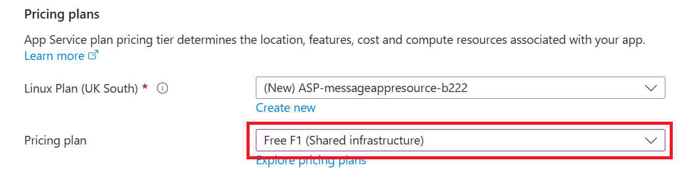
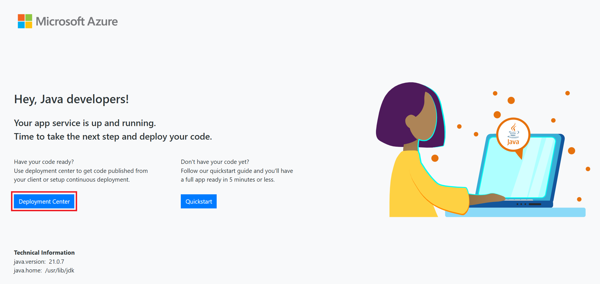

# Deployment på Azure

## Beskrivelse
Så er det tid til at flytte hjemmefra (127.0.0.1).
Nu anvender vi GitHub Actions til et deployment workflow og deployer vores applikation på Microsoft Azure.
Vi ser på "Cloud computing" som teknologimodel, der giver brugerne mulighed for at få adgang til delte computingressourcer (som f.eks. servere, lagring, databaser, netværkstjenester, software, applikationer og mere) via internettet, hvilket er kendt som "skyen".
Vi kommer ind på begreberne: On-Prem, IaaS, PaaS, SaaS, BaaS, og ser på hvor Azure er placeret i disse.

## Forberedelse
Se disse videoer:  
[Cloud Computing Services Models - IaaS PaaS SaaS Explained](https://www.youtube.com/watch?v=36zducUX16w)  
[PaaS Explained](https://www.youtube.com/watch?v=QAbqJzd0PEE)  
[How to deploy Spring boot app to azure with GitHub actions!](https://www.youtube.com/watch?v=sbcPyaqycyI)

Opret en student account på Azure:  
[How To Sign Up for Azure for Students](https://www.youtube.com/watch?v=sbcPyaqycyI)  
NB: Brug din EK microsoft account  

Ressourcer:  
[Azure student subscription - FAQ](https://learn.microsoft.com/da-dk/azure/education-hub/azure-dev-tools-teaching/program-faq#azure-for-students)  
[Azure student subscription - Allowed resource deployment regions](https://portal.azure.com/#view/Microsoft_Azure_Policy/AssignmentDetail.ReactView/id/%2Fsubscriptions%2Fa6560b0d-39a6-4fb3-bd29-f89cfe73c1c8%2Fproviders%2Fmicrosoft.authorization%2Fpolicyassignments%2Fsys.regionrestriction/selectedScopes~/%5B%22%2Fsubscriptions%2Fa6560b0d-39a6-4fb3-bd29-f89cfe73c1c8%22%5D)  
[Azure Latency Test](https://www.azurespeed.com/Azure/Latency)

## Læringsmål
- Kender begreberne: On-Prem, IaaS, PaaS, SaaS, BaaS
- Kan deploye en Spring Boot web applikation til Azure
## Indhold  

### Hvad er Cloud Computing?
Cloud computing er en teknologimodel, hvor brugere får adgang til computing-ressourcer (servere, databaser, lagring, netværk, software mm.) via internettet i stedet for at eje og administrere lokal infrastruktur.  

**Karakteristika:**
- **On-demand selvbetjening** – ressourcer kan oprettes og styres uden manuel indgriben.
- **Bred netværksadgang** – adgang fra enhver enhed med internet.
- **Ressourcedeling** – ressourcer deles mellem mange brugere.
- **Elasticitet** – skaler op/ned efter behov.
- **Pay-as-you-go** – betal kun for det du bruger.

---

## Ansvarsdeling: On-Prem, IaaS, PaaS, SaaS, BaaS

Cloud-modellerne handler om, hvor ansvaret ligger mellem bruger og cloud-udbyder:

- **On-Prem**: Alt styres selv (hardware, netværk, OS, middleware, data, app).
- **IaaS (Infrastructure as a Service)**: Udbyder leverer virtuelle maskiner, lagring og netværk. Brugeren styrer OS, middleware og apps.  
  Eksempler: AWS EC2, Azure Virtual Machines.
- **PaaS (Platform as a Service)**: Udbyder leverer en platform til udvikling og hosting. Brugeren fokuserer på kode og data.  
  Eksempler: Azure App Services, Heroku.
- **SaaS (Software as a Service)**: Hele applikationen leveres som service.  
  Eksempler: Office 365, Google Workspace.
- **BaaS (Backend as a Service)**: Klar backend til mobil- og webapps med API’er.  
  Eksempler: Firebase, AWS Amplify.

Analogi til **at køre bil**:  
- **On-Prem** = du ejer bilen og står for alle udgifter: anskaffelsespris, vedligeholdelse, forsikring, brændstof / el  
- **IaaS** = du leaser bilen og står for visse udgifter: dæk, forsikring, brændstof / el   
- **PaaS** = du lejer bilen og står kun for leje, brændstof / el.
- **SaaS** = du tager en taxa eller bruger offentlig transport.  Pay-as-you-go

---

### Azure App Service

**Azure App Service** er en **PaaS-løsning** hvor du kan hoste web-, API- og mobilapps uden at styre infrastrukturen.  

Fordele:
- Hurtig deployment
- Skalering og load balancing
- Indbygget integration med GitHub Actions

---

### Deployment af en Spring Boot app til Azure
Vi deployer message appen fra uge 35.  
#### Opret en Azure Web App
1. Log ind på [Azure Portal](https://portal.azure.com).
2. Vælg **Create a resource** og vælg **Web App** 


3. Opret en ny **Resource Group** (samling af ressourcer).


4. Indtast **instance details**  

  
Bemærk: Der er kun et begrænset antal regions til rådighed i "free plan", se [Azure student subscription - Allowed resource deployment regions](https://portal.azure.com/#view/Microsoft_Azure_Policy/AssignmentDetail.ReactView/id/%2Fsubscriptions%2Fa6560b0d-39a6-4fb3-bd29-f89cfe73c1c8%2Fproviders%2Fmicrosoft.authorization%2Fpolicyassignments%2Fsys.regionrestriction/selectedScopes~/%5B%22%2Fsubscriptions%2Fa6560b0d-39a6-4fb3-bd29-f89cfe73c1c8%22%5D)  
Hvis man vil se hordan de performer (latency test) kan man benytte [Azure Latency Test](https://www.azurespeed.com/Azure/Latency)  

5. Vælg **Pricing plan**  
Vælg **Free F1 Plan** for at undgå omkostninger. (vigitgt!) 

Tryk "Review + create"

Tryk "Create"  
Efter et stykke tid bliver appen deployed og man kan klikke "Go to resource":    

Nu vises appen's URL på Azure:  

Når man klkker på appen's URl kommer man til defualt landing page og man kan klikke på "Deployment center":  



#### Opret GitHub Actions Workflow  
I deployment center angives Github som source og herefter skal GitHub autoriseres så Azure kan oprette en workflow fil i repoet:  

  
Vælg organization, repository og branch. Klik herefter på "Save":  


   


Når du forbinder dit repo til Azure via Deployment Center, oprettes en YAML-fil i `.github/workflows`.

Eksempel:

```yaml
name: Build and deploy JAR app to Azure Web App - springappdemo

on:
  push:
    branches:
      - main
  workflow_dispatch:

jobs:
  build:
    runs-on: ubuntu-latest
    steps:
      - uses: actions/checkout@v4
      - name: Set up Java
        uses: actions/setup-java@v1
        with:
          java-version: '17'
      - name: Build with Maven
        run: mvn clean install
      - name: Upload artifact
        uses: actions/upload-artifact@v3
        with:
          name: java-app
          path: '${{ github.workspace }}/target/*.jar'

  deploy:
    runs-on: ubuntu-latest
    needs: build
    steps:
      - name: Download artifact
        uses: actions/download-artifact@v3
        with:
          name: java-app
      - name: Deploy to Azure Web App
        uses: azure/webapps-deploy@v2
        with:
          app-name: 'springappdemo'
          slot-name: 'Production'
          package: '*.jar'
          publish-profile: ${{ secrets.AZUREAPPSERVICE_PUBLISHPROFILE }}
```

## Aktiviteter
