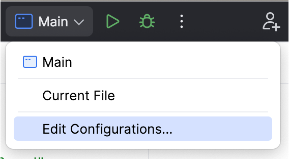
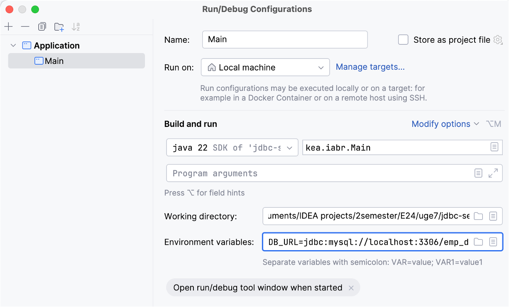
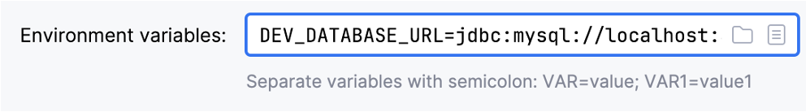
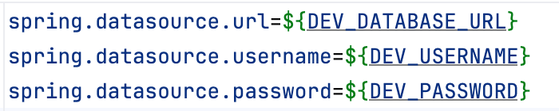
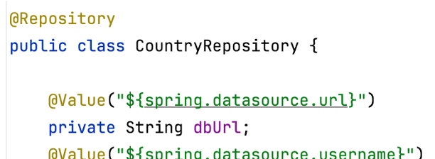

# Opgave: emp_dept med JdbcTemplate

I denne opgave skal vi bruge databasen emp_dept_25 sammen med java-projektet.

1. Klon projektet  [EmpJDBC](https://github.com/SigneBorch/EmpJDBC.git) fra GitHub.
2. Sæt environment-variable i IntelliJ så de passer til dine database credentials. Kopier variabelnavnene fra application_properties filen i projektet. Værdierne på højre side af lighedstegnet skal ligne dem vi brugte i jdbctemplate_standalone når vi lavede vores DataSource, men skift databasenavnet så det er den vi skal bruge her, nemlig emp_dept_25 (i stedet for jdbctemplate_test).
4. Klik på pilen til højre for klassen der kører (øverst til højre i menulinjen) for at åbne "Edit configurations". I dette projekt hedder klassen EmpJDBCApplication.
   
   
   
6. Der kommer et vindue op hvor man kan konfigurere. Klik på "modify options" og vælg "Environment variables" - så kommer feltet frem I kan skrive i.

   
   
   Formen på det i skriver i boksen er: DEV_DATABASE_URL=jdbc:mysql://localhost:3306/emp_dept_25.

   
   
   Skriv de tre variable DEV_DATABASE_URL, DEV_USERNAME og DEV_PASSWORD, og assign dem værdier (root til brugernavnet, og jeres personlige databasepassword til passwordet).

   De tre variable svarer til de variable I har stående inde i application_properties filen i projektet.

   
   
8. Når I har skrevet de tre variable, separeret med semikolon, så tryk apply.
  
9. Kør programmet.

    Det er nu disse variable der bruges inde i Repository-klassen.
   
   
