### MySQL Deployment på Azure

Denne guide beskriver, hvordan man opretter en MySQL database server på Azure 
og efterfølgende opretter en MySQL database ved brug af f.eks. MySQL Workbench.

Det kræver at man har oprettet en konto på Azure og er logget ind i [Azure portalen](https://portal.azure.com)

1. Under Azure services vælg Azure Database for MySQL servers. Hvis Azure Database for MySQL servers er synlig, 
søg efter den i søgefeltet øverst på siden.

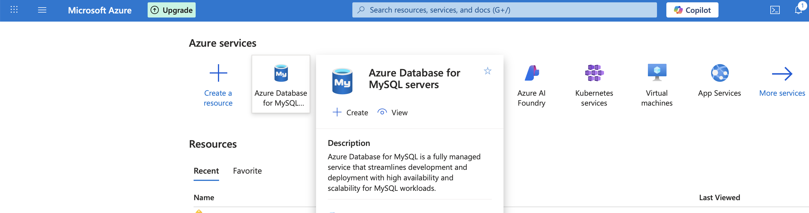

2. Klik på + Create for at oprette en ny MySQL server.

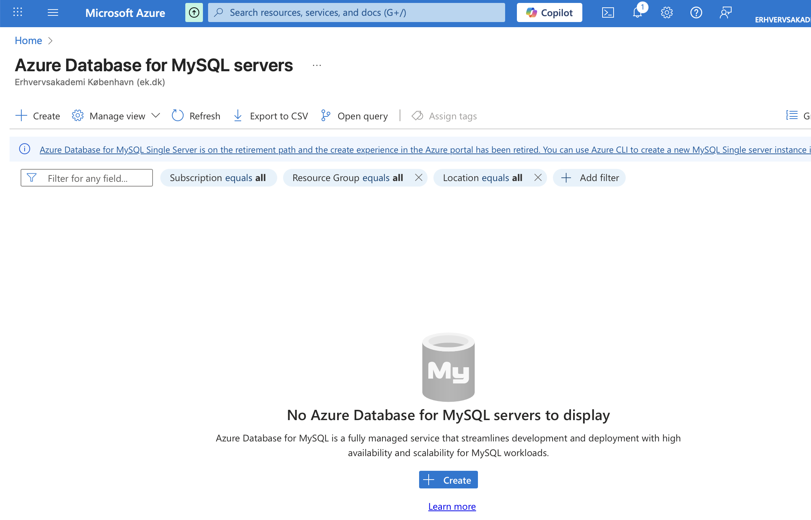

3. Vælg ”Flexible server” og ”Quick Create”

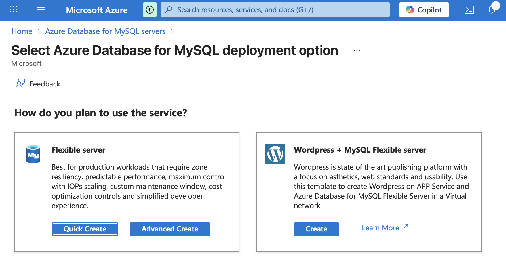

4. Konfigurer serveren:
    1. Opret en ressource group med et passende navn
   2. Skriv et servernavn
   3. Vælg Region ”North Europe”
   4. Angiv et login og password (husk det)
   5. Vælg ”’Dev/Test” som Workload type
   6. Vælg ”Add firewall rule for current IP address”
   7. Vælg “Review + create”

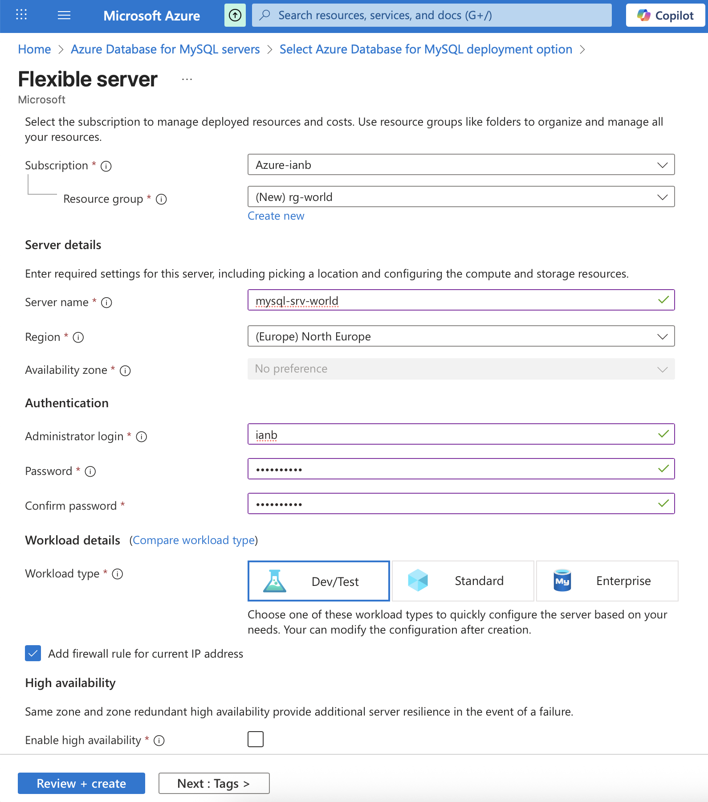

5. Vælg ”Create” for at oprette serveren.

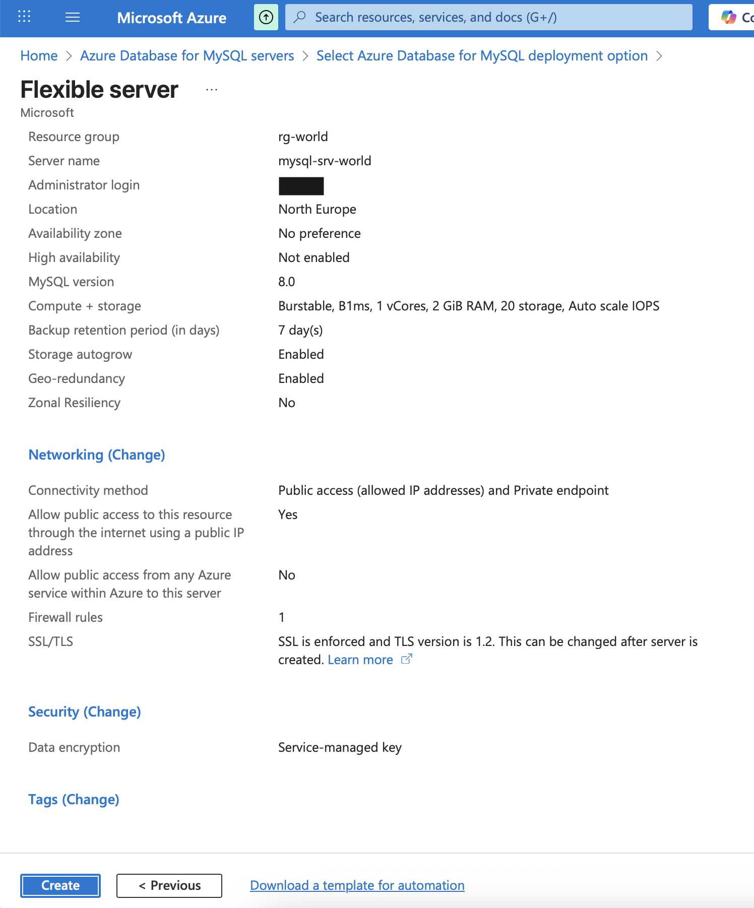

6. En “Deployment is in progress” side vises mens serveren oprettes (det tager flere minutter).

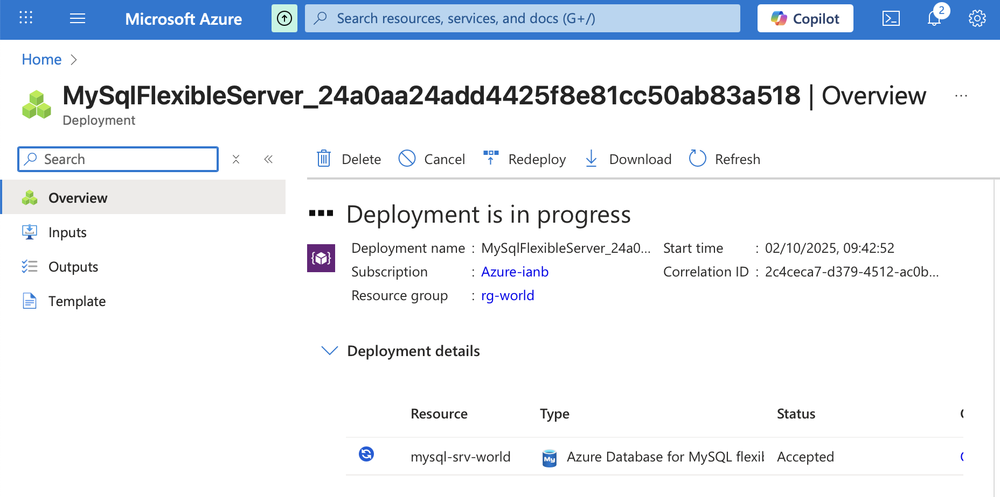

7. Når deployment er færdigt, vælg ”Go to resource”.

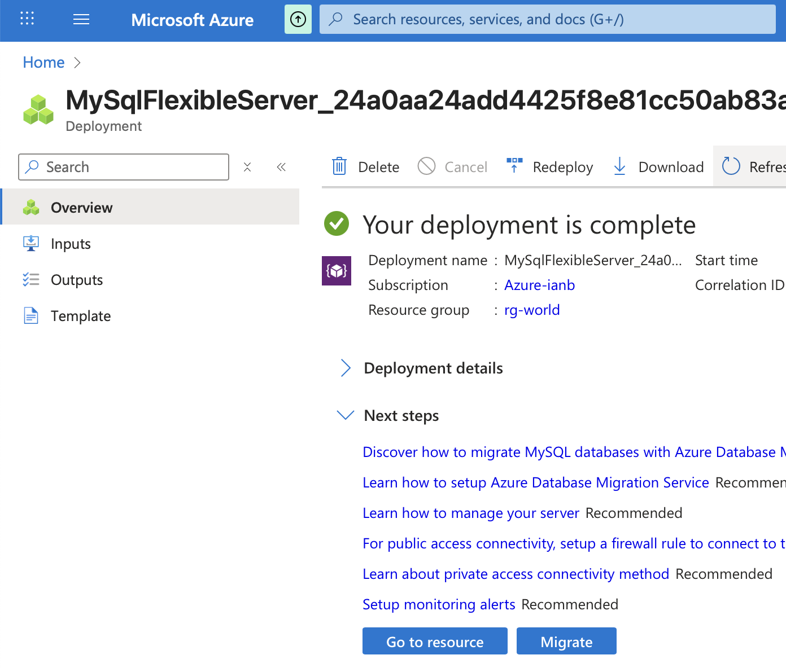

8. Noter ”Server name” url: 

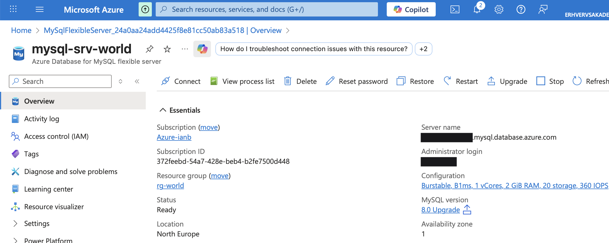

9. Vælg ”Settings” og herunder vælg ”Networking” 
    1. Vælg ”Allow public access from any Azure service within Azure to this server”
    2. Vælg "+ Add current client IP address" (Dette skal gentages hvis klient IP adressen ændres)
   3. Vælg ”Save”

NB. Dette er meget vigtigt, ellers kan den deployede applikation ikke få adgang til databasen.

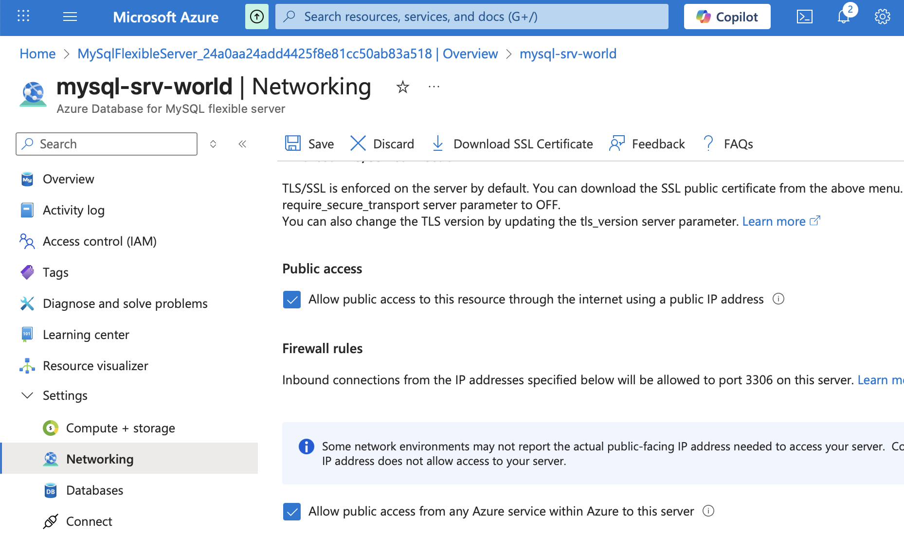

10. En MySQL server er nu oprettet på Azure og der kan nu oprettes en database ved brug af f.eks. MySQL Workbench.
    1.	Opret en ny forbindelse

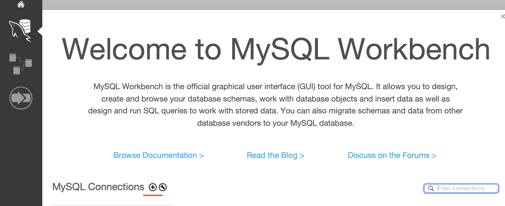

11. Opsæt den nye forbindelse med:
    1. et navn
    2. hostname som er urlen af den server oprettet tidligere på Azure
    3. Username og Password som blev angivet ved optrettelsen af serveren
    4. Vælg ”Test Connection”

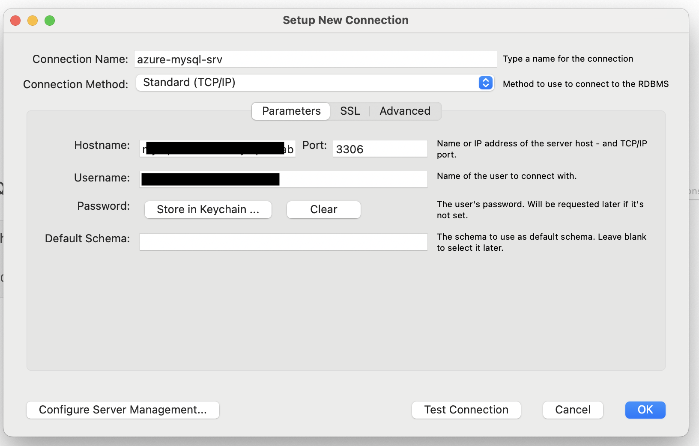

12. Et ”Successfully made the MySQL connection” vindue vises.

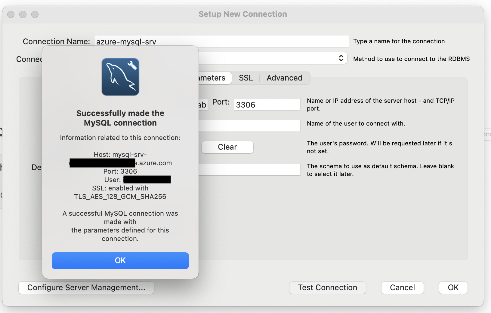

13. Vælg forbindelsen og opret en database ved MySQL Workbench som normalt.

