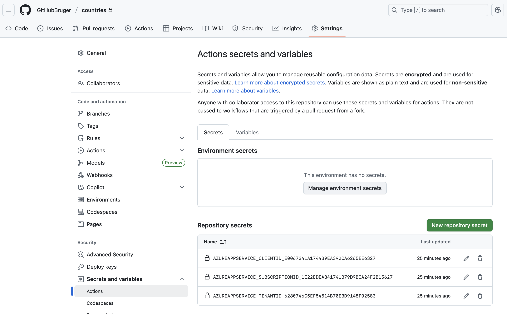
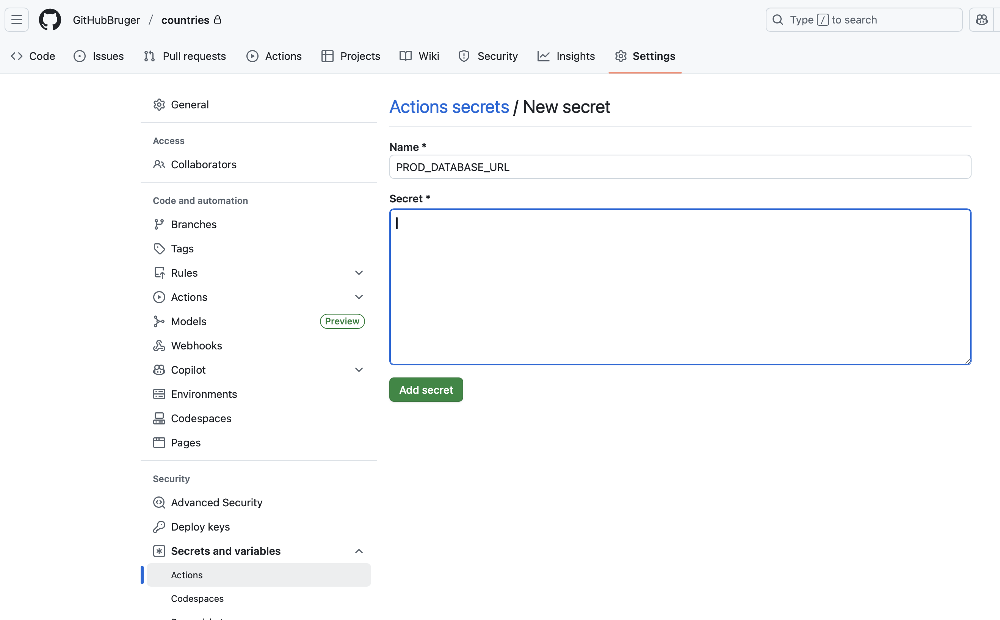
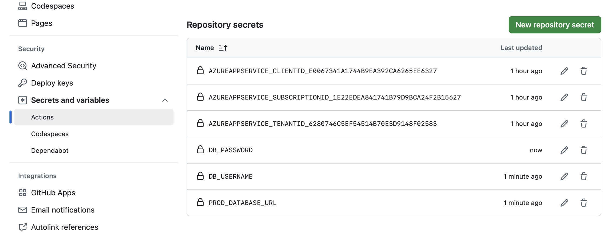
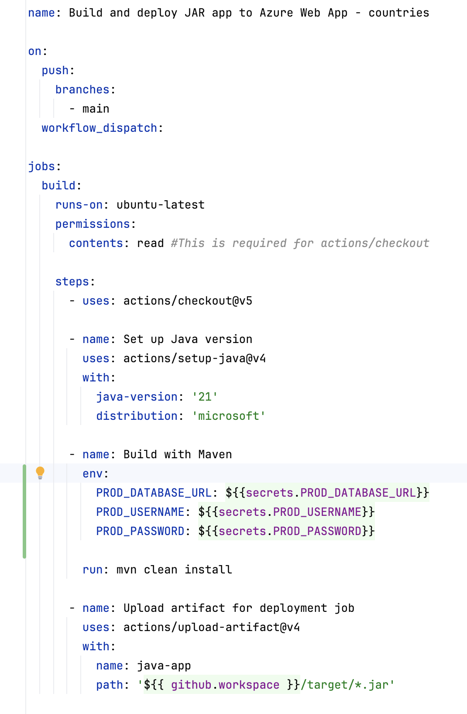
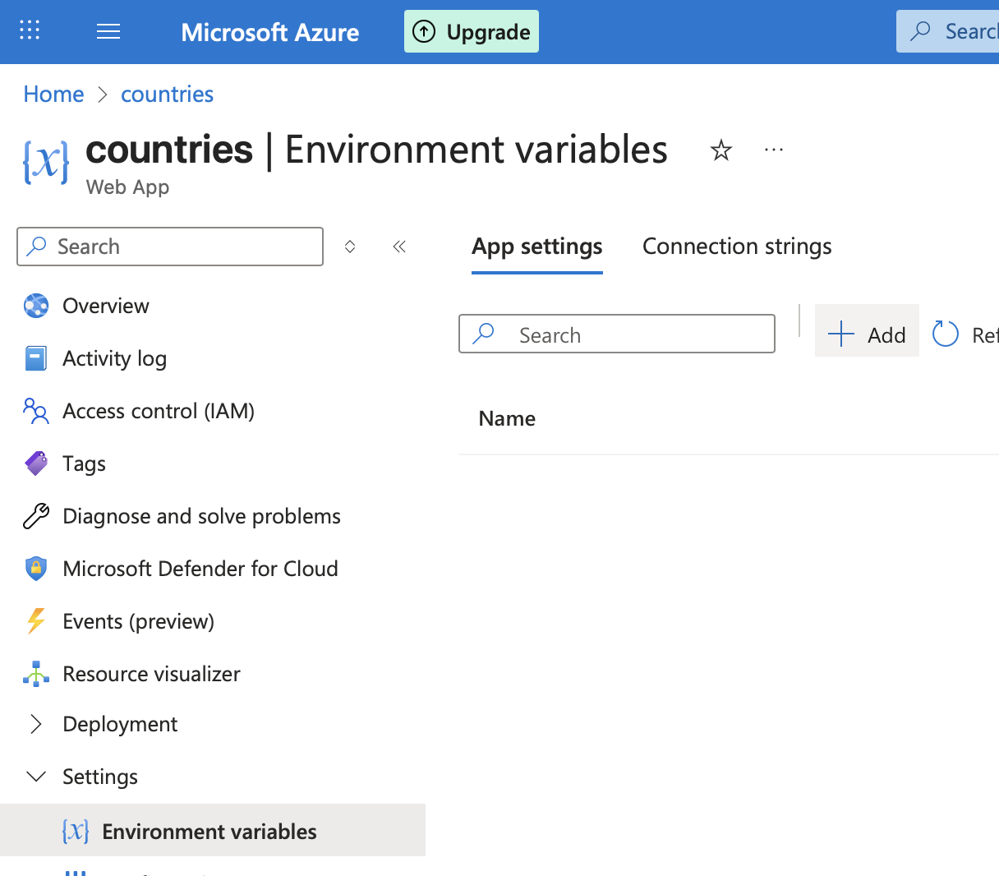
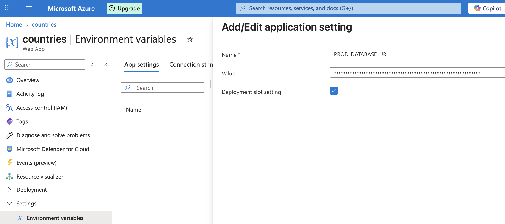
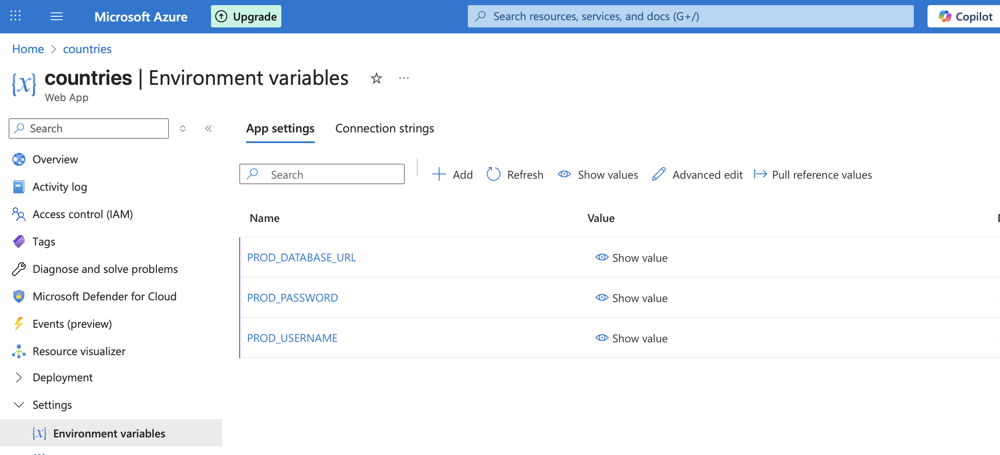

### Opgave: Database integration med Spring Boot applikation

Formålet med opgaven er at kunne integrere en Spring Boot applikation med en MySQL database, der er deployet på Azure.

Database credentials er gemt i et Spring profile, så de ikke er hardcoded i applikationen.

#### Fork starter projekt

1. Fork [countries-starter](https://github.com/EK-DATA-2SEM-PROGSYSTEK/countries-starter.git)

#### Sikre lokal kørsel med lokal database

2. Vi starter med at sikre os, at vi kan køre applikationen lokalt med en lokal database.
    1. Brug MySQL Workbench til at oprette en lokal MySQL database `world`. 
  Brug [schema](schema.sql) og [data](data.sql) SQL scripts til at oprette tabeller og indsætte data i `world` databasen.
   2. Skriv en `select` query i MySQL Workbench for at verificere, at data er korrekt indsat i `countries` tabellen.
   3. I intelliJ, opret local environment variabler med navne svarende til dem i `application-dev.properties` filen 
   og værdierne svarende til din lokale database.
   4. Kør applikationen lokalt med `dev` profile og verificer, at databasen kan tilgåes.

#### Tilføj Spring profile for produktion miljoet

3.  I IntelliJ, tilføj et nyt Spring profile `application-prod.properties` til produktion miljøet i `resources` mappen.
    1. Tilføj følgende properties til `application-prod.properties` filen:
    ```
    spring.datasource.url=${PROD_DATABASE_URL}
    spring.datasource.username=${PROD_USERNAME}
    spring.datasource.password=${PROD_PASSWORD}
    ```
    
Ændr `application.properties` filen til at bruge `prod` profile.


#### Deploy applikationen til Azure

4. Deploye applikationen til Azure igennem Azure portalen.

GitHub Actions workflow vil fejle, da der mangler at angive environment variabler på GitHub og Azure.

Der skal defineres environment variabler:
- på GitHub som GitHub Secrets
- i GitHub Actions workflow filen
- på Azure som Application settings

#### Tilføj environment variabler på GitHub

5. På GitHub, gå til dit forkede repository og vælg Settings -> Secrets and variables -> Actions.
    1. Vælg New repository secret.




   1. Tilføj følgende secrets:
   - `PROD_DATABASE_URL` - URL til den MySQL database du oprettede på Azure (f.eks. `jdbc:mysql://<your-server-navn>:3306/<your-databse-navn>`)
   - `PROD_USERNAME` - brugernavn til databasen
   - `PROD_PASSWORD` - password til databasen






#### Tilføj environment variabler i workflow filen
6. På GitHub, tilføj secrets til GitHub Actions workflow filen i build job inden maven run kommandoen:




### Tilføj environment variabler på Azure
7. På Azure, gå til din App Service og vælg "Settings" -> "Environment variables" -> "+ Add".




   1. Tilføj følgende Application settings:
   - `PROD_DATABASE_URL` - URL til den MySQL database du oprettede på Azure (f.eks. `jdbc:mysql://<your-server-navn>:3306/<your-databse-navn>`)
   - `PROD_USERNAME` - brugernavn til databasen
   - `PROD_PASSWORD` - password til databasen




Vælg "Apply" for at gemme ændringerne.




Vælg "Apply" for at redeploye.