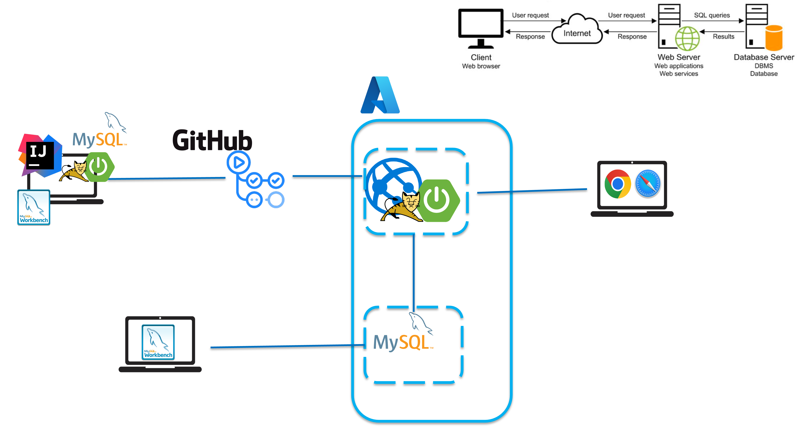
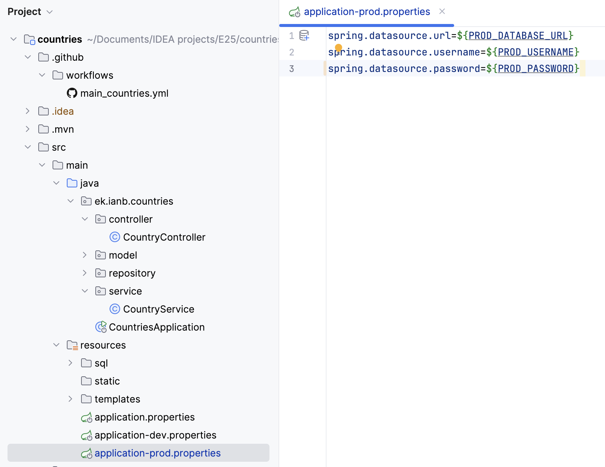
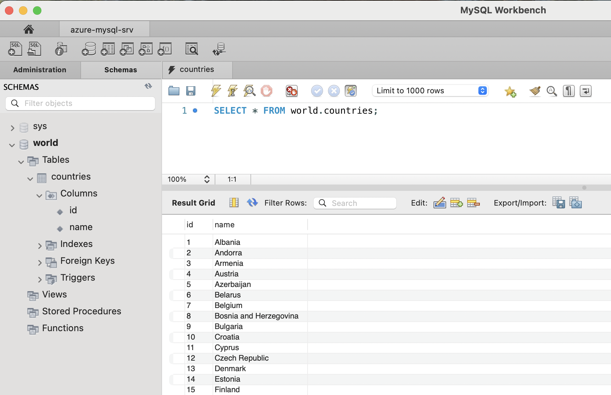
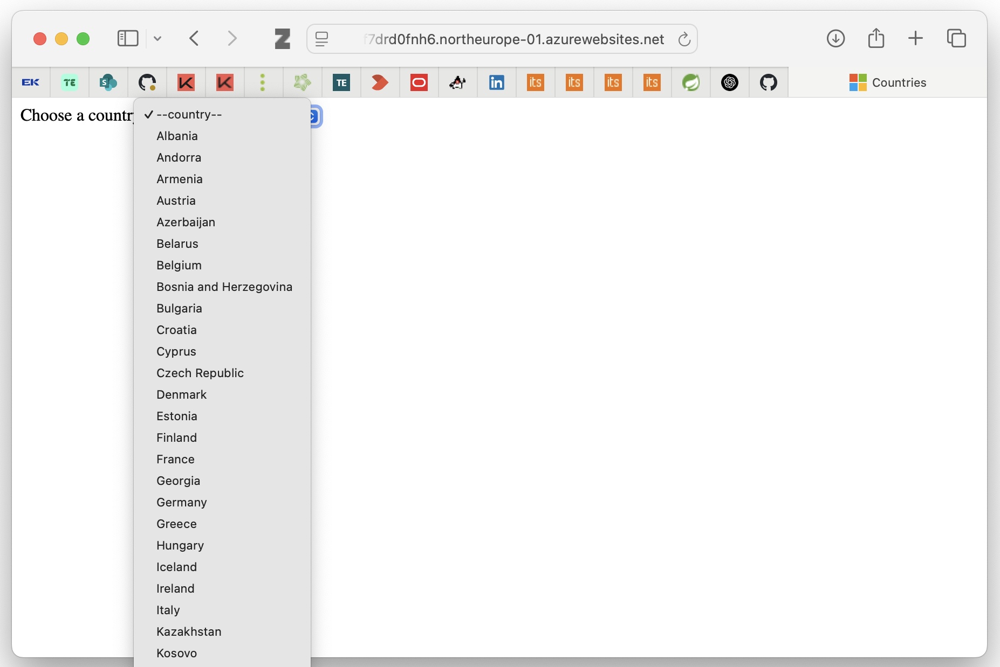

# Database Deployment

---

## Beskrivelse

Vi deployer en database på Azure og kigger på integration med vores Spring Boot web app.

---

## Læringsmål

- At kunne deploye en mysql database

- At kunne integrere en deployed database i en deployed Spring Boot applikation

---

## Indhold

- Spring profiles
- Database deployment på Azure
- Integration med en Spring Boot applikation

---

### Overblik



---

### Spring Profiles

Spring Profiles er en måde i Spring/Spring Boot til at konfigurere appliaktionen, afhængigt af hvilket miljø den kører i.

Der kan være forskellige konfigurationer (fx databaseforbindelse, logging, sikkerhed) til:
- development (lokal udvikling)
- test (testmiljø eller CI/CD pipeline)
- production (driftsmiljø)


Der kan oprettes forskellige `application-{profile}.properties` filer til hvert miljø, fx:
- `application-dev.properties` (lokal udvikling)
- `application-test.properties` (testmiljø)
- `application-prod.properties` (produktionsmiljø)

`application.properties` er fælles for alle profiler

Profiles kan aktiveres ved at sætte `spring.profiles.active` property i `application.properties` filen f.eks.:
```spring.profiles.active=dev```



---

## Database Deployment på Azure

### Deployed Database



---

Deployed applikation med database integration

  


---

### [Opgave: Deploy en MySQL database på Azure](opgave-db-deployment.md)

---

### [Opgave: Integration med deployed application](opgave-database-integration.md)


---

## Aktiviteter

[Opgave: Deploy en MySQL database på Azure](opgave-db-deployment.md)

[Opgave: Integration med deployed application](opgave-database-integration.md)

Opgave: Deploye Turistguide database på Azure og integrere i Turistguide applikationen