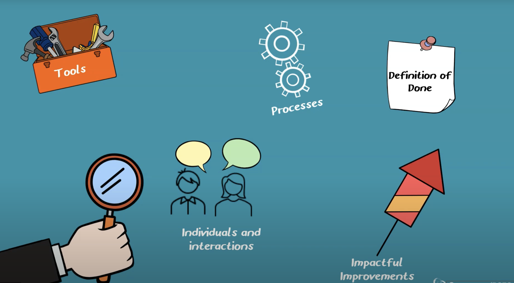

# Afslutning Wishlist-projekt: feedback & retrospective

---

## Beskrivelse

Vi starter med, at gruppen demonstrerer applikationens funktionalitet til underviseren.
Efterfølgende gives der formativ feedback gennem en dialog om design, implementering, test m.m.

Når man ikke er i gang med sit kode review gennemføres en Sprint Retrospective, hvor teamet reflekterer over det netop afsluttede sprint.

Tidsplanen for tilbagemelding findes her: [Hold A](Demo-Code-Review-Wishlist-HoldA.pdf) og [Hold B](Demo-Code-Review-Wishlist-HoldB.pdf)

---

## Forberedelse

Læs:

[The Sprint Retrospective](https://www.scrum.org/learning-series/sprint-retrospective/introduction-to-the-sprint-retrospective-)

Se videoen:

[How to Facilitate the Sprint Retrospective](https://www.scrum.org/resources/how-facilitate-sprint-retrospective)

---

## Læringsmål

- At kunne udføre en Sprint Retrospective i et Scrum team

---

## Indhold

### The Scrum Guide on the Sprint Retrospective

*"The purpose of the Sprint Retrospective is to plan ways to increase quality and effectiveness.*

*The Scrum Team inspects how the last Sprint went with regards to individuals, interactions, processes, tools, 
and their Definition of Done. Inspected elements often vary with the domain of work. 
Assumptions that led them astray are identified and their origins explored. 
The Scrum Team discusses what went well during the Sprint, what problems it encountered, and how those problems were (or were not) solved.*

*The Scrum Team identifies the most helpful changes to improve its effectiveness. The most impactful improvements are addressed as soon as possible. They may even be added to the Sprint Backlog for the next Sprint.*

*The Sprint Retrospective concludes the Sprint. It is timeboxed to a maximum of three hours for a one-month Sprint. 
For shorter Sprints, the event is usually shorter."*

---

### Sprint Retrospective

&copy; Scrum.org

---

### Opgave - Sprint Retrospective

Med udgangspunkt i det gennemførte sprint i projektet, udfør en sprint retrospective:

Brug jeres GitHub project board til at oprette søjler til de tre sektioner:

- Hvad gik godt?
- Hvad gik ikke godt?
- Hvad kan forbedres?

Hver gruppemedlem skal oprette mindst 3 kort i hver sektion.

Diskuter herefter hvert kort i plenum.

Lav en liste (ny søjle) over forbedringer som teamet er enige om bør gennemføres.

Lad teamet prioritere denne liste og vælge de 1-2 vigtigste at arbejde med i næste sprint.

---

## Aktiviteter

