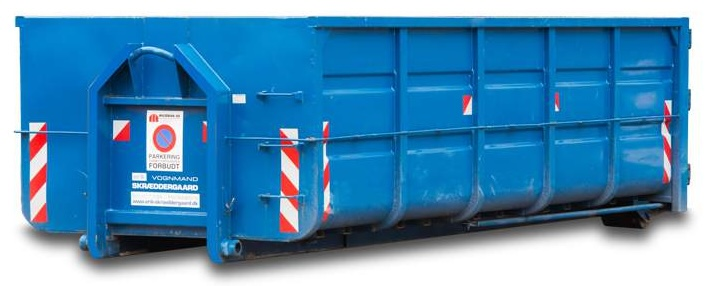
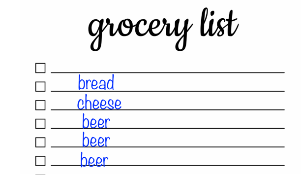
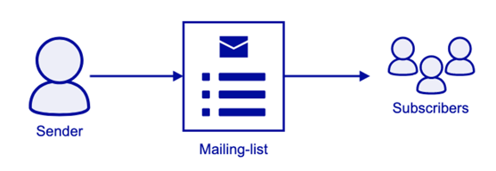
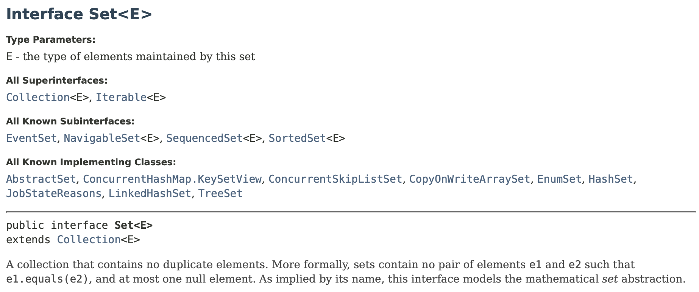
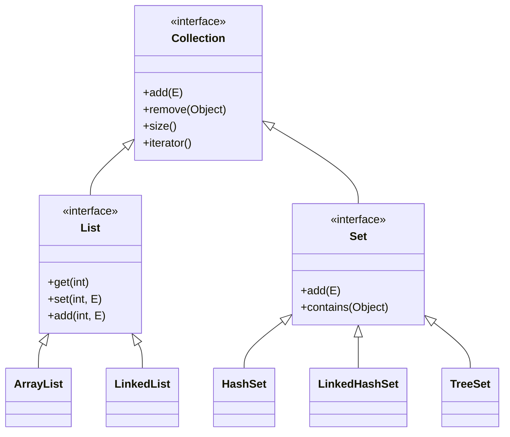
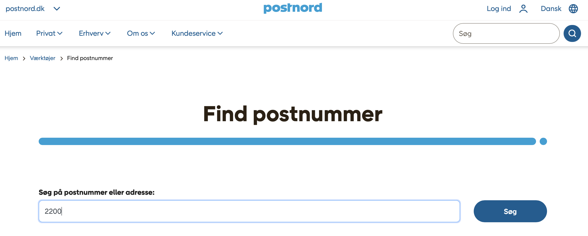
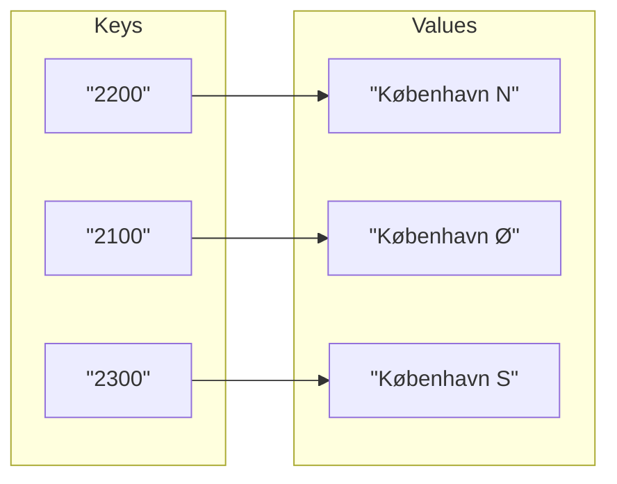
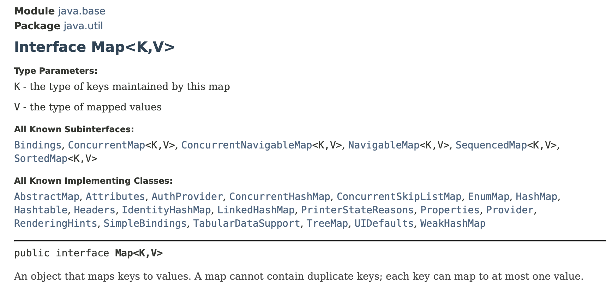
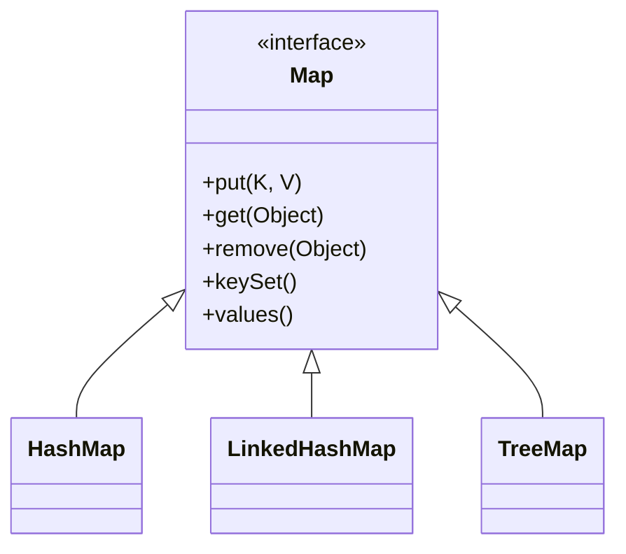

# Java Collections Framework (og Wishlist projekt feedback fortsat)

## Beskrivelse

Vi kigger nærmere på Java Collections Framework og de forskellige typer af Collections, deres egenskaber
samt hvordan man vælger den rette Collection type til en given opgave.

---

## Forberedelse

Læs: 

[Getting to Know the Collection Hierarchy](https://dev.java/learn/api/collections-framework/organization/)

[Using Maps to Store Key Value Pairs](https://dev.java/learn/api/collections-framework/maps/)

---

## Læringsmål

- At kunne anvende Java Collections interfaces og klasser 
(herunder Set, Map, List, HashSet, TreeSet, HashMap og TreeMap)
- At kunne vælge den rette Collection type til en given opgave

  
---

## Indhold

---

 `ArrayList` - one size fits all?

---

Egenskaber for en indkøbslist, emaillist?

---

---

## [Set](https://docs.oracle.com/en/java/javase/21/docs/api/java.base/java/util/Set.html)

---

---

Andre egneskaber for en "collection"...

---

---

---

## [Map](https://docs.oracle.com/en/java/javase/21/docs/api/java.base/java/util/Map.html)

---

---

### Collections opsummering

- **List**: **Ordnet sekvens**, tillader duplikater, har **indeks**.
- **Set**: Mængde af **unikke** elementer, ingen indeks, orden afhænger af implementering.
- **Map**: **Nøgle → værdi-opslag**; nøgler er unikke, værdier kan gentage; ikke en Collection, men har views (keySet, values, entrySet).

## Aktiviteter

### Opgave

[Opgave: Tour de France](Tour-de-France-2025-Øvelse.pdf)