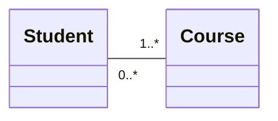
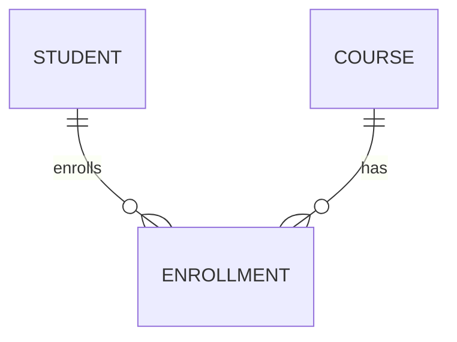
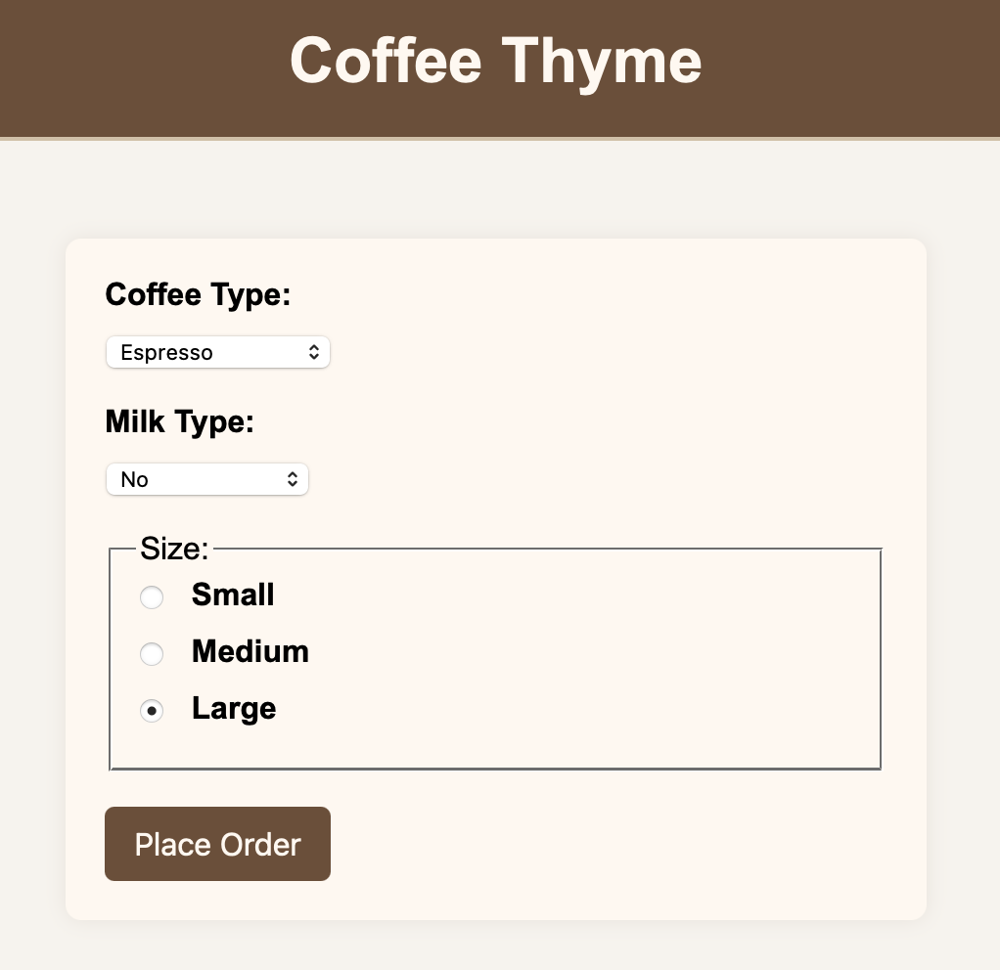

# Repetition (Udvalgte emner)

## Indhold

### Domænemodel

En domænemodel er en konceptuel model af problemdomænet (konteksten i den virkelige verden).


Den viser de centrale begreber (entiteter) og deres relationer.


Det skaber en fælles forståelse mellem forretning og udvikling.


Den vises typisk som et uml klassediagram men indeholder ikke software klasser.




---

### Entity Relationship (ER) modeller
En ER-model er en konceptuel datamodel til at beskrive et problemdomænes data og deres indbyrdes relationer som 
forarbejde til en fysiske relationsdatabase struktur. 


ER-modellen beskriver hvad data er og hvordan de hænger sammen, uden implementeringsdetaljer.


En M:N (mange til mange) relation mellem to entities kan ikke direkte implementeres i en relationsdatabase 
uden at bl.a. 1NF brydes (atomiske værdier og ingen gentagne grupper/kolonner).

En M:N relation nedbrydes derfor til to 1:N relationer ved at indføre en associativ entitet (junction tabel).

Enrollment tabellen vil bestå af et komposit primærnøgle bestående af fremmednøgler student_id og course_id.



---

### Normalisering

#### Formålet

Det overordnede formål med normalisering er at organisere data i en database på en måde,
der reducerer redundans og forbedrer dataintegritet.

Det gøres ved at opdele data i mindre, relaterede tabeller og definere relationer mellem dem.

Data integritet betyder, at data i et system er korrekte, konsistente og pålidelige når
de bliver oprettet, opdateret, lagret og anvendes.

---

#### Normalformer

Først Normalform (1NF) - Atomiske værdier
- Alle attributter (kolonner) indeholder kun atomiske værdier (ikke lister eller gentagelser).

Andet Normalform (2NF) - Fuld funktionel afhængighed
- Kræver først 1NF.
- Alle ikke-nøgleattributter skal være fuldt afhængige af hele komposit primærnøglen (ikke kun en del af den).

Tredje Normalform (3NF) - Ingen transitive afhængigheder
- Kræver først 2NF.
-  Ingen ikke-nøgleattributter må være afhængige af en anden ikke-nøgleattribut

---

1NF?

| CourseID (PK) | CourseName        | LecturerEmail         | LecturerName | StudentID (FK)      |
|---------------|-------------------|-----------------------|--------------|---------------------|
| 101           | Databaser         | jensen@uni.example    | Anja Jensen  | S1001, S1002, S1003 |
| 102           | Programming       | hansen@uni.example    | Emma Hansen  | S1004, S1005        |
| 103           | Web Development   | smith@uni.example     | John Smith   | S1001, S1006        |

---

1NF? 2NF?

| CourseID (PK) | StudentID (PK, FK) | CourseName      | LecturerEmail       | LecturerName |
|---------------|--------------------|-----------------|---------------------|--------------|
| 101           | S1001              | Databaser       | jensen@uni.example  | Anja Jensen  |
| 101           | S1002              | Databaser       | jensen@uni.example  | Anja Jensen  |
| 101           | S1003              | Databaser       | jensen@uni.example  | Anja Jensen  |
| 102           | S1004              | Programming     | hansen@uni.example  | Emma Hansen  |
| 102           | S1005              | Programming     | hansen@uni.example  | Emma Hansen  |
| 103           | S1001              | Web Development | smith@uni.example   | John Smith   |
| 103           | S1006              | Web Development | smith@uni.example   | John Smith   |

---

2NF? 3NF?

Courses

| CourseID (PK) | CourseName      | LecturerEmail       | LecturerName |
|---------------|-----------------|---------------------|--------------|
| 101           | Databaser       | jensen@uni.example  | Anja Jensen  |
| 102           | Programming     | hansen@uni.example  | Emma Hansen  |
| 103           | Web Development | smith@uni.example   | John Smith   |


Enrollments

| CourseID (PK, FK) | StudentID (PK, FK) |
|-------------------|--------------------|
| 101               | S1001              |
| 101               | S1002              |
| 101               | S1003              |
| 102               | S1004              |
| 102               | S1005              |
| 103               | S1001              |
| 103               | S1006              |

---

3NF?

Lecturers

| LecturerID (PK) | LecturerEmail        | LecturerName |
|-----------------|----------------------|--------------|
| 1               | jensen@uni.example   | Anja Jensen  |
| 2               | hansen@uni.example   | Emma Hansen  |
| 3               | smith@uni.example    | John Smith   |


Courses

| CourseID (PK) | CourseName      | LecturerID (FK) |
|---------------|-----------------|-----------------|
| 101           | Databaser       | 1               |
| 102           | Programming     | 2               |
| 103           | Web Development | 3               |


Enrollments

| CourseID (PK, FK) | StudentNo (PK, FK) |
|-------------------|--------------------|
| 101               | S1001              |
| 101               | S1002              |
| 101               | S1003              |
| 102               | S1004              |
| 102               | S1005              |
| 103               | S1001              |
| 103               | S1006              |


Students

| StudentNo (PK) | StudentName       |
|----------------|-------------------|
| S1001          | Mads Nielsen      |
| S1002          | Emma Sørensen     |
| S1003          | William Andersen  |
| S1004          | Sarah Johnson     |
| S1005          | Peter Christensen |
| S1006          | Lucy Thompson     |

---

### Spring Boot og Thymeleaf

Forms



---

`Model` klassen bruges til at sende data fra controlleren til viewet (Thymeleaf skabelonen).

`@ModelAttribute` annoteringen bruges til at binde form data til en model objekt i controlleren.


```Java
@Controller
@RequestMapping("/coffee")
public class CoffeeOrderController {
    private  CoffeeOrderService coffeeOrderService;

    public CoffeeOrderController(CoffeeOrderService coffeeOrderService) {
        this.coffeeOrderService = coffeeOrderService;
    }

    @GetMapping
    public String showOrderForm(Model model, CoffeeOptions coffeeOptions) {
        CoffeeOrder coffeeOrder = new CoffeeOrder();
        coffeeOrder.setCoffeeSize(coffeeOptions.getCoffeeSizes().getLast());
        model.addAttribute("coffeeOrder", coffeeOrder);
        model.addAttribute("coffeeTypes", coffeeOptions.getCoffeeTypes());
        model.addAttribute("milkTypes", coffeeOptions.getMilkTypes());
        model.addAttribute("coffeeSizes", coffeeOptions.getCoffeeSizes());
        return "order-form";
    }

    @PostMapping("/order")
    public String placeOrder(@ModelAttribute CoffeeOrder coffeeOrder, RedirectAttributes redirectAttributes) {
        CoffeeOrder placedOrder = coffeeOrderService.placeOrder(coffeeOrder);
        redirectAttributes.addFlashAttribute("coffeeOrder", placedOrder);
        return "redirect:/coffee/show-order";
    }

    @GetMapping("/show-order")
    public String showOrderConfirmation() {
        return "order-confirmation";
    }
}
```

`RedirectAttributes` bruges til at sende data ved en redirect (Post/Redirect/Get mønsteret). 
En almindelig `Model` objekt ville ikke bevare data ved en redirect.


```html
<form th:action="@{/coffee/order}" th:object="${coffeeOrder}" method="post">
            <input type="hidden" th:field="*{orderId}" />

            <label for="coffeeType">Coffee Type:</label>
            <select id="coffeeType" th:field="*{coffeeType}">
                <option value="" disabled selected>Choose a type…</option>
                <option th:each="type : ${coffeeTypes}"
                        th:value="${type}"
                        th:text="${type}">
                </option>
            </select>
            <br><br>

            <label for="milkType">Milk Type:</label>
            <select id="milkType" th:field="*{milkType}">
                <option value="" disabled selected>Choose milk…</option>
                <option th:each="milk : ${milkTypes}"
                        th:value="${milk}"
                        th:text="${milk}">
                </option>
            </select>
            <br><br>

            <fieldset>
                <legend>Size:</legend>
                <div th:each="size : ${coffeeSizes}">
                    <label>
                        <input type="radio" th:field="*{coffeeSize}" th:value="${size}" />
                        <span th:text="${size}">Size</span>
                    </label>
                </div>
            </fieldset>
            <br>

            <button type="submit">Place Order</button>
        </form>
```

---

### Test

Controller test med MockMvc og Mockito (Web layer slice test).

```java
@WebMvcTest(CoffeeOrderController.class)
class CoffeeOrderControllerTest {
    @Autowired
    private MockMvc mockMvc;

    @MockitoBean
    private CoffeeOrderService coffeeOrderService;

    @BeforeEach
    void setUp() {
    }

    @AfterEach
    void tearDown() {
    }

    @Test
    void shouldShowOrderForm() throws Exception {
        mockMvc.perform(get("/coffee"))
                .andExpect(status().isOk())
                .andExpect(view().name("order-form"));
    }


    @Test
    void shouldPlaceOrder() throws Exception {
        mockMvc.perform(post("/coffee/order")
                        .param("coffeeType", "Flat White")
                        .param("coffeeSize", "Medium")
                        .param("milkType", "Skim"))
                .andExpect(status().is3xxRedirection())
                .andExpect(view().name("redirect:/coffee/show-order"));

        ArgumentCaptor<CoffeeOrder> captor = ArgumentCaptor.forClass(CoffeeOrder.class);
        verify(coffeeOrderService).placeOrder(captor.capture());

        CoffeeOrder captured = captor.getValue();
        assertEquals("Flat White", captured.getCoffeeType());
        assertEquals("Medium", captured.getCoffeeSize());
        assertEquals("Skim", captured.getMilkType());
        assertNotNull(captured.getOrderId()); // UUID generated as expected
    }
}

```

---

Integrationstest med H2 database.


H2 er en lille, hurtig, Java-baseret relationel database, der kan køre in-memory (eller som fil) inde i din JVM-proces. 
Det gør den ideel til hurtige, integrationstests uden ekstern opsætning.

```java
@SpringBootTest
@ActiveProfiles("test")
@Sql(scripts = "classpath:h2init.sql", executionPhase = BEFORE_TEST_METHOD)
class PersonRepositoryTest {

    @Autowired
    private PersonRepository repo;

    @Test
    void readAll() {
        List<Person> all = repo.findAll();

        assertThat(all).isNotNull();
        assertThat(all.size()).isEqualTo(2);
        assertThat(all.get(0).getName()).isEqualTo("Alice");
        assertThat(all.get(1).getName()).isEqualTo("Bob");
    }


    @Test
    void insertAndReadBack() {
        repo.save(new Person(3, "Carol"));
        var carol = repo.findById(3);
        assertThat(carol).isNotNull();
        assertThat(carol.getName()).isEqualTo("Carol");
    }
}

```

Spring test profile

Der laves en selvstændig apllication-test.properties i test miljøet, der indeholde opsætningsparametre for H2 databasen.  
Filen placeres i /test/resources mappen

```properties
spring.datasource.url=jdbc:h2:mem:testdb;DB_CLOSE_DELAY=-1;DB_CLOSE_ON_EXIT=FALSE
spring.datasource.driverClassName=org.h2.Driver
spring.datasource.username=sa
spring.datasource.password=

# Vis SQL i logs (nyttigt i testfasen)
logging.level.org.springframework.jdbc.core.JdbcTemplate=DEBUG
logging.level.org.springframework.jdbc.core.StatementCreatorUtils=TRACE

```

```DB_CLOSE_DELAY=-1```  
Denne parameter betyder, at databasen ikke lukkes automatisk, selvom den sidste forbindelse til den bliver lukket.  

```DB_CLOSE_ON_EXIT=FALSE```  
Denne parameter sikrer, at databasen ikke lukker, når JVM'en (Java Virtual Machine) afsluttes.  

I et testmiljø bruges disse parametre for at sikre, at den indlejrede H2-database forbliver tilgængelig 
og i en kendt tilstand gennem hele test-livscyklussen, især når man kører en suite af integrationstests.  

---

### System overblik


---

### CI/CD pipeline i GitHub Actions

GitHub Actions er en CI/CD platform indbygget i GitHub, der gør det muligt 
at automatisere bygge-, test- og deploy-processer direkte fra et GitHub repository.

Workflow filen (.yaml fil) definerer en serie af jobs og steps, der udføres baseret på specifikke events.

- Trigger: En event som f.eks. push til main branch eller en pull request.

- Runner: En virtuel maskine eller container, hvor jobs kører (fx ubuntu-latest)

- Job: En samling af steps, der kører på en runner. Jobs kan køre sekventielt eller parallelt.

- Step: En individuel opgave inden for et job. En step kan enten køre en kommando (run:) eller bruge en action (uses:).


---

workflow fil


```yaml
name: Build and deploy JAR app to Azure Web App - countries

on:
  push:
    branches:
      - main
  workflow_dispatch:

jobs:
  build:
    runs-on: ubuntu-latest
    permissions:
      contents: read #This is required for actions/checkout

    steps:
      - uses: actions/checkout@v5

      - name: Set up Java version
        uses: actions/setup-java@v4
        with:
          java-version: '21'
          distribution: 'microsoft'

      - name: Build with Maven
        env:
          PROD_DATABASE_URL: ${{secrets.PROD_DATABASE_URL}}
          PROD_USERNAME: ${{secrets.PROD_USERNAME}}
          PROD_PASSWORD: ${{secrets.PROD_PASSWORD}}

        run: mvn clean install

      - name: Upload artifact for deployment job
        uses: actions/upload-artifact@v4
        with:
          name: java-app
          path: '${{ github.workspace }}/target/*.jar'

  deploy:
    runs-on: ubuntu-latest
    needs: build
    permissions:
      id-token: write #This is required for requesting the JWT
      contents: read #This is required for actions/checkout
  
    steps:
      - name: Download artifact from build job
        uses: actions/download-artifact@v4
        with:
          name: java-app
      
      - name: Login to Azure
        uses: azure/login@v2
        with:
          client-id: ${{ secrets.AZUREAPPSERVICE_CLIENTID_E0067341A1744B9EA392CA6265EE6327 }}
          tenant-id: ${{ secrets.AZUREAPPSERVICE_TENANTID_6280746C5EF54514B70E3D9148F02583 }}
          subscription-id: ${{ secrets.AZUREAPPSERVICE_SUBSCRIPTIONID_1E22EDEA841741B79D9BCA24F2B15627 }}

      - name: Deploy to Azure Web App
        id: deploy-to-webapp
        uses: azure/webapps-deploy@v3
        with:
          app-name: 'countries'
          slot-name: 'Production'
          package: '*.jar'

```

---

## Aktiviteter
