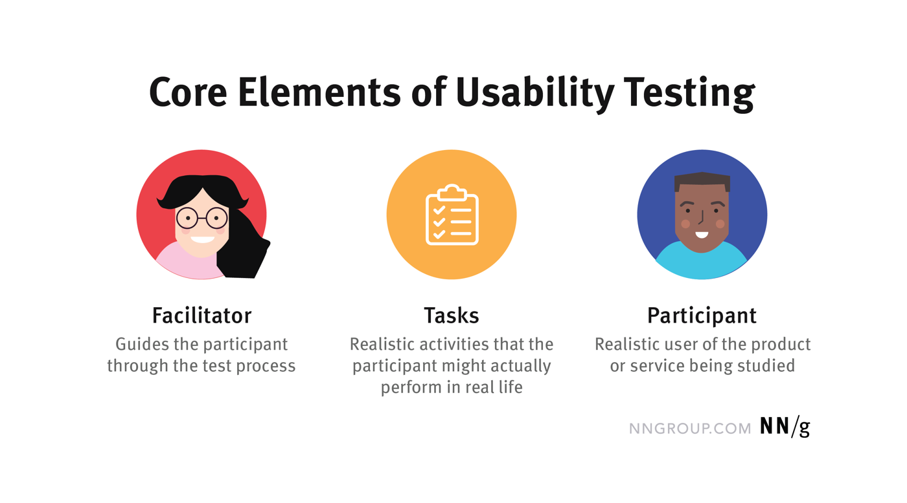

# Usability test

## Beskrivelse

Dagens program er at vi gennemgår og diskuterer hvorfor man laver usability testing, og hvordan det rent praktisk gøres.   I skal derefter selv prøve at lave en usability test.

## Forberedelse

Læs om usability testing [her](https://www.nngroup.com/articles/usability-testing-101/)

Se video om usability testing (2 min) [her](https://www.youtube.com/watch?v=n8MnoJyl3W4)

Læs om tænke-højt-test [her](https://www.nngroup.com/articles/thinking-aloud-the-1-usability-tool)

## Læringsmål

- at kunne udføre en usability test med tænke-højt-metoden

## Indhold

### Hvorfor laver man usability tests?

### Hvornår laver man usability tests?

### Elementerne i en usability test

### Hvordan udvælger man test-deltagere?

Se videoen [1st Pillar of usability testing: Typical users](https://www.youtube.com/watch?v=o29up51Sxs8)

### Hvordan skal opgaverne være?

Se videoen [2nd Pillar of usability testing: Appropriate tasks](https://www.youtube.com/watch?v=dkKS6aKEC6M)

### Hvordan kan man bearbejde de observationer man får under testen?

Se et eksempel i [denne video](https://www.youtube.com/watch?v=uG_JrhMG-_U), fra 5.25.

